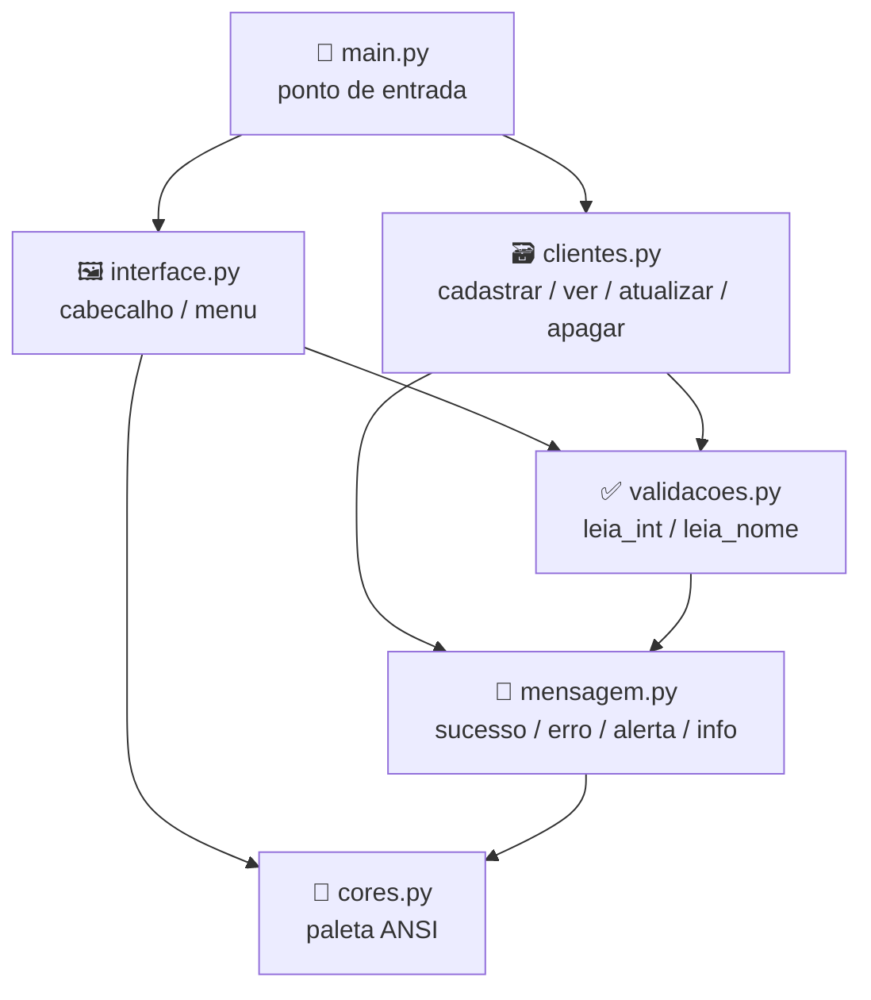
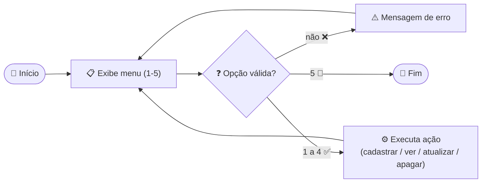

<h1 align="center">
  Curso em Video - Python Mundo 3 <br> 🖥️ Menu Terminal — Cadastro de Clientes <br>
   🏪
</h1>

<p align="center">
  
</p>

<p align="center">
    
    
    
    
    
</p>

>Material de apoio do **exercício 115** (Mundo 3) — um menu de terminal em **Python** para **cadastrar, listar, atualizar e apagar clientes**, com validação de entrada, mensagens padronizadas e cores ANSI, tudo organizado em módulos. 

<h2 align="left">🧭 Sumário: </h2>

1. [O que é o menu terminal?](#1-o-que-e)
2. [Estrutura do projeto](#2-estrutura)
3. [Fluxo do menu](#3-fluxo)
4. [Anatomia dos módulos](#4-anatomia)
   - [4.1 `cores.py` — paleta ANSI](#41-cores)
   - [4.2 `mensagem.py` — mensagens padronizadas](#42-mensagem)
   - [4.3 `validacoes.py` — leitura validada](#43-validacoes)
   - [4.4 `interface.py` — cabeçalho e menu](#44-interface)
   - [4.5 `clientes.py` — CRUD da lista](#45-clientes)
   - [4.6 `main.py` — ponto de entrada](#46-main)
5. [Operações do CRUD](#5-operacoes)
6. [Como executar?](#6-executar)
7. [Armadilhas comuns](#7-armadilhas)
8. [Resumo final](#8-resumo)

<h2 align="left" id="1-o-que-e">🧩 1. O que é o menu terminal?</h2>

É um **loop de menu** que fica exibindo opções numeradas no terminal até o usuário escolher **Sair**. Cada opção dispara uma função responsável por manipular uma **lista de dicionários** (`clientes`), que funciona como um banco de dados em memória — cada cliente é `{"nome": ..., "idade": ...}`.

| Característica | Descrição |
|---|---|
| 🔁 Estrutura | `while True` com `break` na opção de saída |
| 🗂️ Armazenamento | Lista de dicionários em memória (sem persistência em arquivo) |
| 🎨 Visual | Cores ANSI (`cores.py`) + mensagens padronizadas (`mensagem.py`) |
| ✅ Entrada | Sempre validada antes de aceitar (`validacoes.py`) |
| 🧱 Organização | Cada responsabilidade em seu próprio módulo (`lib/`) |

<h2 align="center" id="2-estrutura"> 🏰 2. Arquitetura do Exercício <br>
</h2>

<pre>
ex115🖥️/
├── lib/
│   ├── cores.py 
│   ├── mensagem.py 
│   ├── validacoes.py 
│   ├── interface.py 
│   └── clientes.py 
│
├── python/
│   └── main.py 
│
└── md/
    └── MENU_TERMINAL.md 
</pre>



<h2 align="left" id="3-fluxo">🔀 3. Fluxo do menu</h2>

O `main.py` mantém uma lista `acoes` na mesma ordem das opções do menu, e associa a **opção escolhida** à **função correspondente** pelo índice — sem precisar de um `if/elif` gigante.



<h2 align="left" id="4-anatomia">🔬 4. Anatomia dos módulos</h2>

<h3 align="left" id="41-cores">4.1 `cores.py` — paleta ANSI</h3>

Constantes com os códigos de escape ANSI usadas em todo o programa. `Reset` sempre encerra a formatação para não "vazar" cor para o resto do terminal.

```python
Vermelho     = "\033[1;31m"
Verde        = "\033[1;32m"
Amarelo      = "\033[1;33m"
MagentaClaro = "\033[1;95m"
CinzaClaro   = "\033[1;37m"
Negrito      = "\033[;1m"
Reset        = "\033[0;0m"  # remove formatação
```

> ⚠️ Esquecer o `{Reset}` no fim de um `print` deixa a cor "vazando" para as próximas linhas do terminal.

<h3 align="left" id="42-mensagem">4.2 `mensagem.py` — mensagens padronizadas</h3>

Centraliza o "estilo" de cada tipo de mensagem, para que `clientes.py` e `validacoes.py` nunca precisem escolher a cor na mão.

```python
def sucesso(texto): print(f"{Verde}{texto}{Reset}")
def erro(texto):    print(f"{Vermelho}{texto}{Reset}")
def alerta(texto):  print(f"{Amarelo}{texto}{Reset}")
def info(texto):    print(f"{MagentaClaro}{texto}{Reset}")
```

<h3 align="left" id="43-validacoes">4.3 `validacoes.py` — leitura validada</h3>

Repete o `input()` até receber um valor aceitável, mostrando `mensagem.erro` a cada tentativa inválida.

```python
def leia_int(msg):
    valor = str(input(msg).strip())
    while not (valor.lstrip("-").isdigit()):
        mensagem.erro("ERRO!❌ Digite um número inteiro válido.")
        valor = str(input(msg).strip())
    return int(valor)

def leia_nome(msg):
    nome = str(input(msg).strip())
    while not (nome.replace(" ", "").isalpha()):
        mensagem.erro("ERRO!❌ Digite um nome válido (somente letras).")
        nome = str(input(msg).strip())
    return nome.title()
```

| Função | Aceita | Rejeita |
|---|---|---|
| `leia_int` | números inteiros (inclusive negativos) | letras, símbolos, vazio |
| `leia_nome` | letras e espaços | números, símbolos, vazio |

<h3 align="left" id="44-interface">4.4 `interface.py` — cabeçalho e menu</h3>

`cabecalho` desenha uma moldura de `-` centralizando o texto; `menu` reaproveita `cabecalho` para o título e devolve a opção já validada como `int`.

```python
def cabecalho(texto):
    print(f"{Negrito}{linha()}")
    print(texto.center(42))
    print(f"{linha()}{Reset}")

def menu():
    cabecalho(f"\t{MagentaClaro}MENU{Reset}")
    opcoes = ["Cadastrar cliente", "Ver clientes",
              "Atualizar cliente", "Apagar cliente", "Sair"]
    for indice, contador in enumerate(opcoes):
        print(f"[{indice+1}] - {contador}")
    print(f"{Negrito}{linha()}{Reset}")
    return validacoes.leia_int(f"{CinzaClaro}Escolha uma opção: {Reset}")
```

<h3 align="left" id="45-clientes">4.5 `clientes.py` — CRUD da lista</h3>

Cada função recebe a **mesma lista** `clientes` por referência e a modifica no lugar — é por isso que `main.py` só precisa criar `clientes = list()` uma única vez.

```python
def cadastrar(clientes):
    nome = validacoes.leia_nome("Nome: ")
    idade = validacoes.leia_int("Idade: ")
    clientes.append({"nome": nome.title(), "idade": idade})
    mensagem.sucesso(f"Cliente {nome} cadastrado com sucesso! ✅")
```

`_selecionar` (privada, prefixo `_`) é o helper comum entre `atualizar` e `apagar`: pede o número do cliente, aceita `ESC` para cancelar, e valida o intervalo antes de devolver o índice.

<h3 align="left" id="46-main">4.6 `main.py` — ponto de entrada</h3>

A lista `acoes` mapeia posição → função. `enumerate(acoes)` compara `indice_opcao + 1` com a opção digitada, evitando um bloco `if opcao == 1: ... elif opcao == 2: ...` repetitivo.

```python
def main():
    clientes = list()
    cabecalho("CADASTRO DE CLIENTES 🏪")
    acoes = [cli.cadastrar, cli.ver, cli.atualizar, cli.apagar]
    while True:
        opcao = menu()
        if opcao == 5:
            break
        for indice_opcao, funcao in enumerate(acoes):
            if opcao == indice_opcao + 1:
                funcao(clientes)
                break
        else:
            erro("Opção inválida! Escolha um número de 1 a 5. ❌")
```

<h2 align="left" id="5-operacoes">⚙️ 5. Operações do CRUD</h2>

| Opção | Função | O que faz | Lista vazia |
|---|---|---|---|
| `[1]` | `cadastrar` | Lê nome + idade e adiciona à lista | — |
| `[2]` | `ver` | Imprime todos os clientes numerados | Mostra alerta ❌ |
| `[3]` | `atualizar` | Seleciona um cliente e substitui nome/idade | Mostra alerta ❌ |
| `[4]` | `apagar` | Seleciona um cliente e remove com `.pop()` | Mostra alerta ❌ |
| `[5]` | — | Encerra o `while True` com `break` | — |

<h2 align="left" id="6-executar">▶️ 6. Como executar? </h2>

Como os módulos usam import absoluto (`from ex115.lib import ...`), rode a partir da **raiz do `Mundo3`**, tratando `ex115` como pacote (`-m`):

```bash
cd Mundo3
python3 -m ex115.python.main
```

> 💡 **Dica:** rodar `python3 ex115/python/main.py` diretamente quebra os imports — sempre use `-m` a partir de `Mundo3/`, igual ao padrão já usado em [`utilidadesCeV`](../../utilidadesCeV/README.md).

<h2 align="left" id="7-armadilhas">🚧 7. Armadilhas comuns</h2>

| ⚠️ Problema | 💥 Consequência | 🛠️ Como evitar |
|---|---|---|
| Rodar `main.py` sem `-m` | `ImportError` nos imports absolutos | Sempre `python3 -m ex115.python.main` a partir de `Mundo3` |
| Esquecer `{Reset}` numa cor | Terminal "mancha" as próximas linhas | Sempre fechar o `f-string` com `{Reset}` |
| Chamar `atualizar`/`apagar` com lista vazia sem checar | `_selecionar` retornaria de uma lista vazia | Checar `if not clientes` antes, como já é feito |
| Digitar texto onde se espera número | Loop indefinido do `while` em `leia_int` | Esperado: `leia_int` só sai do loop com um inteiro válido |

<h2 align="left" id="8-resumo">📌 8. Resumo final</h2>

```
┌───────────────────────────────────────────────────────────┐
│  MENU TERMINAL — CADASTRO DE CLIENTES                       │
├───────────────────────────────────────────────────────────┤
│  🔁 loop while True + break na opção "Sair"                  │
│  🗂️ lista de dicionários como "banco" em memória              │
│  🎯 índice da opção → função (sem if/elif gigante)            │
│  ✅ toda entrada passa por validacoes.py antes de ser aceita  │
│  🎨 cores.py + mensagem.py padronizam a saída no terminal     │
└───────────────────────────────────────────────────────────┘
```

> 🎓 **Conclusão:** separar cores, mensagens, validação, interface e CRUD em módulos próprios é o que permite trocar qualquer peça (por exemplo, persistir os clientes em arquivo) sem tocar nas demais — o mesmo princípio de responsabilidade única que vale em qualquer projeto maior.
