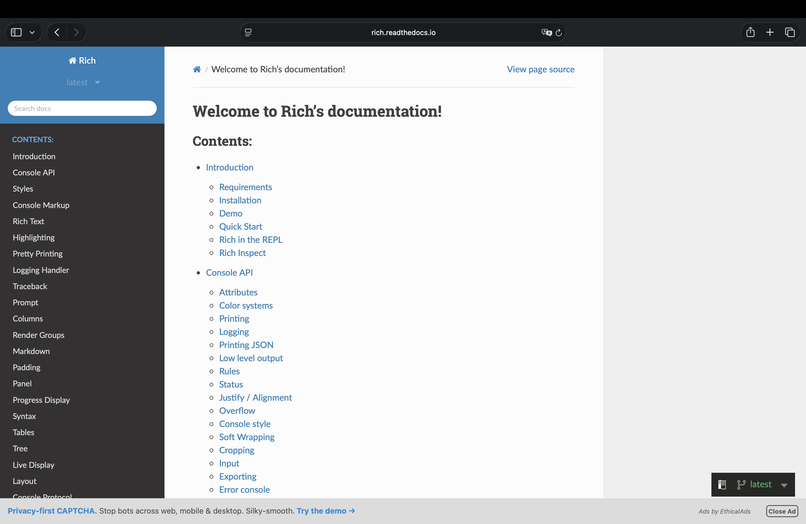

<h1 align="center">
  Curso em Video - Python Mundo 4 <br> Biblioteca Rich — Deixando o Terminal (de verdade) Rico <br>
  🎨📦
</h1>

<p align="center">
  
</p>

<p align="center">
    
    
    
    
    
</p>

>Aula extra do curso: "tornando nosso código mais rico". Explica por que os códigos ANSI manuais de [`cores.py`](../cores.py) têm limites, e como a biblioteca [Rich](https://github.com/Textualize/rich) — já usada em [`118.py`](../118.py) — resolve esses limites com markup, `Console`, `Panel`, `Table` e barras de progresso. 

<p align="center">
  
</p>

<h2 align="left">🧭 Sumário: </h2>

1. [O problema: cores.py e os códigos ANSI manuais](#1-problema)
2. [O que é a Rich e por que ela existe](#2-o-que-e)
3. [Instalação](#3-instalacao)
4. [rich.print(): markup em vez de escapes crus](#4-print)
5. [Console e estilos com style=](#5-console)
6. [Panel: emoldurando conteúdo](#6-panel)
7. [Table: tabelas de verdade](#7-table)
8. [track / Progress: barra de progresso](#8-progress)
9. [Bônus: traceback bonito e inspeção de objetos](#9-bonus)
10. [Na prática: reescrevendo a ContaBancaria com Rich](#10-pratica)
11. [Quando usar cores.py puro vs. Rich](#11-quando-usar)
12. [Resumo final](#12-resumo)

<h2 align="left" id="1-problema">🚨 1. O problema: cores.py e os códigos ANSI manuais</h2>

```python
#Site = https://raccoon.ninja/pt/post/dev/tabela-de-cores-ansi-python/

Verde =	"\033[1;32m"
Vermelho = "\033[1;31m"
CinzaClaro ="\033[1;37m"
Reset  = "\033[0;0m" #(remove formatação)
```

`cores.py` funciona colando sequências de escape ANSI (`\033[1;32m`) direto na string. É simples e didático, mas escala mal — o próprio projeto já sente isso em [`117_conta_bancaria.py`](../117_conta_bancaria.py):

```python
def __str__(self):
    return f"""{CinzaClaro}O id da sua conta é: {self.id}, seu saldo é de: {Verde}R${Reset}{CinzaClaro}{self.saldo:.2f}\n
    Títular: {self.titular}{Reset}"""
```

| Limitação do `cores.py` | Por quê |
|---|---|
| **Ilegível rápido** | Cada cor exige abrir `{Cor}` e fechar `{Reset}` manualmente; esquecer um `Reset` "vaza" a cor para o resto do terminal |
| **Sem estrutura visual** | Não existe jeito de fazer tabelas, painéis ou bordas sem desenhar caractere por caractere |
| **Sem barra de progresso** | Precisaria reescrever a linha inteira com `\r` na mão, controlando largura e posição |
| **Sem detecção de ambiente** | Se a saída for redirecionada para um arquivo ou não suportar ANSI, os `\033[...]` aparecem como texto cru, sem nenhuma verificação automática |
| **Mistura conteúdo e estilo** | A cor fica embutida na própria string, no meio do texto — ver [MELHORANDO_CLASSES.md, seção 5](MELHORANDO_CLASSES.md#5-srp) |

<h2 align="left" id="2-o-que-e">📦 2. O que é a Rich e por que ela existe</h2>

<p align="center">
  
</p>

[Rich](https://github.com/Textualize/rich) é uma biblioteca Python (por Will McGugan / [Textualize](https://www.textualize.io/)) para formatação de texto e saída bonita no terminal: cores e estilos, tabelas, painéis, barras de progresso, *markdown*, *syntax highlighting*, *tracebacks* legíveis e mais. Diferente de escrever `\033[...]` na mão, a Rich:

- Detecta automaticamente as capacidades do terminal (cores truecolor, 256 cores, ou nenhuma cor se a saída não for um terminal de verdade);
- Funciona sem configuração extra no Windows;
- Separa **conteúdo** de **estilo** — o texto e a cor não precisam ficar entrelaçados na mesma string;
- Oferece componentes prontos (tabela, painel, progresso) em vez de exigir desenhá-los manualmente.

<h2 align="left" id="3-instalacao">⚙️ 3. Instalação</h2>

```bash
pip install rich
```

<p align="center">
  
</p>

> 📚 A documentação oficial — [rich.readthedocs.io](https://rich.readthedocs.io) — cobre bem mais do que este resumo: `Markdown`, `Tree`, `Syntax` (*highlighting* de código), `Prompt`, `Live Display` e outros componentes que não cabem aqui.

<h2 align="left" id="4-print">🖨️ 4. rich.print(): markup em vez de escapes crus</h2>

O jeito mais simples de usar a Rich, já demonstrado em [`118.py`](../118.py), é importar seu próprio `print()`:

```python
from rich import print

print("[bold green]Sucesso![/bold green] Biblioteca [italic cyan]Rich[/italic cyan] instalada e funcionando. ✅")
```

Em vez de intercalar `{Cor}texto{Reset}` como em `cores.py`, a Rich usa **marcações** parecidas com tags: `[estilo]texto[/estilo]`. O estilo fecha sozinho — não existe "esquecer o Reset" porque o `[/estilo]` já delimita onde ele acaba.

| `cores.py` | Rich |
|---|---|
| `print(f"{Verde}Sucesso!{Reset}")` | `print("[green]Sucesso![/green]")` |
| `print(f"{Vermelho}Erro{Reset}: {CinzaClaro}algo falhou{Reset}")` | `print("[red]Erro[/red]: algo falhou")` |
| Combinar negrito + cor exige saber o código exato (`\033[1;32m`) | Combina estilos livremente: `[bold green]...[/bold green]` |

<h2 align="left" id="5-console">🖥️ 5. Console e estilos com style=</h2>

O objeto `Console` é a API central da Rich (equivalente a um `print()` "avançado"), útil quando o estilo se aplica à linha inteira:

```python
from rich.console import Console

console = Console()
console.print("Texto com fundo colorido", style="white on blue")
```

Aqui o estilo (`"white on blue"`) fica separado do conteúdo (`"Texto com fundo colorido"`) — dois parâmetros distintos, em vez de concatenados na mesma string como em `cores.py`. Isso facilita, por exemplo, aplicar o mesmo estilo a textos diferentes sem duplicar código.

<h2 align="left" id="6-panel">🖼️ 6. Panel: emoldurando conteúdo</h2>

```python
from rich.panel import Panel

console.print(Panel("Painel de destaque com borda e título", title="Aviso", border_style="magenta"))
```

Um `Panel` desenha uma borda ao redor do conteúdo, com título opcional — algo que, com `cores.py`, exigiria desenhar caracteres de caixa (`┌─┐│└┘`) manualmente e calcular a largura do texto para alinhar tudo.

<h2 align="left" id="7-table">📊 7. Table: tabelas de verdade</h2>

```python
from rich.table import Table

tabela = Table(title="Usuários cadastrados")
tabela.add_column("Nome", style="cyan", justify="left")
tabela.add_column("Idade", style="green", justify="center")

tabela.add_row("Lucas", "22")
tabela.add_row("Maria", "30")
tabela.add_row("Ruan", "53")

console.print(tabela)
```

A `Table` calcula sozinha a largura de cada coluna a partir do conteúdo, alinha os valores e ainda aceita uma cor por coluna. Reproduzir isso com `print(f"{coluna1:<10}{coluna2:>5}")` e códigos ANSI intercalados é possível, mas cada nova coluna significa recalcular todos os espaçamentos na mão.

<h2 align="left" id="8-progress">⏳ 8. track / Progress: barra de progresso</h2>

```python
from rich.progress import track
from time import sleep

for indice, _ in enumerate(track(range(5), description="Processando...")):
    sleep(0.2)
```

`track()` transforma qualquer iterável em uma barra de progresso animada, com tempo estimado e porcentagem. Com `cores.py` isso exigiria reescrever a mesma linha do terminal repetidamente usando `\r` (retorno de carro) e recalcular manualmente a barra a cada iteração — bem mais frágil.

<h2 align="left" id="9-bonus">🎁 9. Bônus: traceback bonito e inspeção de objetos</h2>

Dois recursos que não têm equivalente prático em `cores.py`:

```python
from rich.traceback import install
install()  # a partir daqui, qualquer exceção não tratada aparece formatada e mais legível
```

```python
from rich import inspect

inspect(conta1, methods=True)  # mostra atributos, métodos e docstring de um objeto, formatado
```

`inspect()` cobre, de forma automática e formatada, o mesmo tipo de exploração feita manualmente em [`117_teste_classe.py`](../117_teste_classe.py) com `__dict__` e `__doc__`.

<h2 align="left" id="10-pratica">🏦 10. Na prática: reescrevendo a ContaBancaria com Rich</h2>

<p align="center">
  
</p>

Como visto em [MELHORANDO_CLASSES.md, seção 5](MELHORANDO_CLASSES.md#5-srp), a versão original de `ContaBancaria.__str__` mistura o cálculo do saldo com a formatação colorida:

```python
# antes — cores.py, cor embutida na própria string
def __str__(self):
    return f"""{CinzaClaro}O id da sua conta é: {self.id}, seu saldo é de: {Verde}R${Reset}{CinzaClaro}{self.saldo:.2f}\n
    Títular: {self.titular}{Reset}"""
```

Com a lógica de negócio já separada da apresentação (ContaBancaria 2.0, sem `cores.py` nenhum dentro da classe), a exibição fica isolada numa função à parte, usando markup da Rich — mais curto e mais legível que a versão original:

```python
# depois — a classe não conhece nem cores.py, nem Rich; só devolve texto puro
def __str__(self) -> str:
    return f"Conta #{self.id} de {self.titular}: R$ {self.saldo:.2f}"
```

```python
# a exibição "rica" vive fora da classe, na camada de apresentação
from rich import print
from rich.panel import Panel

def mostrar_conta(conta: ContaBancaria) -> None:
    print(Panel(
        f"[bold]{conta.titular}[/bold]\nSaldo: [green]R$ {conta.saldo:.2f}[/green]",
        title=f"Conta #{conta.id}",
        border_style="cyan",
    ))

mostrar_conta(conta1)
```

Trocar a "casca" visual (`cores.py` → Rich, ou Rich → uma futura interface web) agora significa reescrever só `mostrar_conta()` — a classe `ContaBancaria` não muda uma linha.

<h2 align="left" id="11-quando-usar">⚖️ 11. Quando usar cores.py puro vs. Rich</h2>

| Cenário | Melhor opção |
|---|---|
| Aprender o que são códigos ANSI e como o terminal interpreta cores | `cores.py` (ótimo para fins didáticos) |
| Script pequeno, uma ou duas cores, sem tabelas/painéis | `cores.py` já resolve, sem dependência extra |
| Qualquer coisa com tabelas, progresso, painéis ou markup combinado | Rich — reimplementar isso na mão não compensa |
| Projeto que precisa rodar de forma previsível no Windows sem setup extra | Rich |
| Log de erros/exceções mais fácil de ler durante o desenvolvimento | Rich (`rich.traceback.install()`) |

<h2 align="left" id="12-resumo">📌 12. Resumo final</h2>

```
┌──────────────────────────────────────────────────────────────────┐
│  BIBLIOTECA RICH                                                  │
├──────────────────────────────────────────────────────────────────┤
│  🖨️ print()      → markup [estilo]texto[/estilo] no lugar de \033 │
│  🖥️ Console      → estilo como parâmetro, separado do conteúdo    │
│  🖼️ Panel        → moldura com título, sem desenhar bordas na mão │
│  📊 Table        → colunas alinhadas e coloridas automaticamente  │
│  ⏳ track()      → barra de progresso pronta, sem hack de \r      │
│  🎁 traceback/inspect → erros e objetos formatados automaticamente │
└──────────────────────────────────────────────────────────────────┘
```

> 🎓 **Conclusão:** `cores.py` ensina a base — o que de fato é um código ANSI — mas a Rich é o que se usa quando o objetivo deixa de ser "colorir uma linha" e passa a ser "comunicar informação de forma clara" no terminal: tabelas, painéis, progresso e erros legíveis, tudo com uma API que separa conteúdo de estilo em vez de misturar os dois na mesma string .
