<h1 align="center">
  Curso em Video - Python Mundo 4 <br> Classes, Objetos e Instâncias — O Molde e o Biscoito <br>
  🍪🧬
</h1>

<p align="center">
  
</p>

<p align="center">
    
    
    
    
    
    
</p>

>Aprofundamento da seção *"Fundamentação: os conceitos da POO"* do [PYTHON_E_POO.md](PYTHON_E_POO.md#5-fundamentacao) — a **Fase 03** do curso, que explica **classe**, **objeto** e **instância** com a analogia de um cortador de biscoitos e o biscoito assado a partir dele. 

<h2 align="left">🧭 Sumário: </h2>

1. [O que são objetos e classes?](#1-titulo)
2. [A analogia: dessa vez, biscoitos](#2-biscoitos)
3. [Classe: o cortador de biscoitos](#3-classe)
4. [A estrutura de uma classe](#4-estrutura)
5. [Atributos e métodos](#5-atributos-metodos)
6. [Exemplo completo: a classe BiscoitoCoracao](#6-exemplo)
7. [Instância e instanciar](#7-instanciar)
8. [Classe vs. objeto, lado a lado](#8-classe-objeto)
9. [Definição: o que é um objeto](#9-definicao-objeto)
10. [Estado: os valores de um objeto em um dado momento](#10-estado)
11. [Objetos abstratos](#11-abstratos)
12. [Resumo final](#12-resumo)

<h2 align="left" id="1-titulo">❓ 1. O que são objetos e classes?</h2>

<p align="center">
  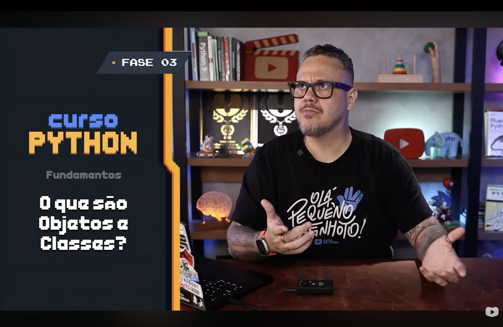
</p>

A Fase 03 do curso fecha a fundamentação teórica da POO respondendo à pergunta mais básica de todas: o que, na prática, **é** uma classe e o que **é** um objeto. É esse vocabulário que sustenta toda linha de código escrita a partir do exercício `116`.

<h2 align="left" id="2-biscoitos">🍪 2. A analogia: dessa vez, biscoitos</h2>

<p align="center">
  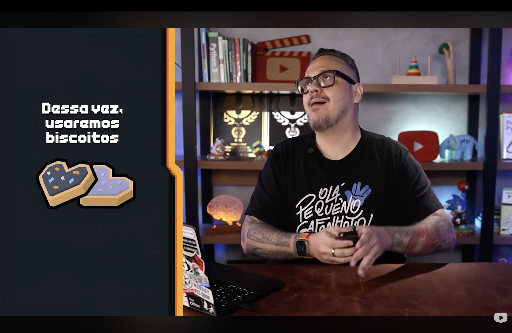
</p>

Depois do carro usado em [AS_6_VANTAGENS_POO.md](AS_6_VANTAGENS_POO.md#2-analogia) para explicar as vantagens da POO, a analogia muda para explicar a **origem** dos objetos: biscoitos em formato de coração. A escolha não é aleatória — biscoitos deixam claro algo que o carro não mostra tão bem: **de onde** um objeto vem antes mesmo de existir.

<h2 align="left" id="3-classe">🧬 3. Classe: o cortador de biscoitos</h2>

<p align="center">
  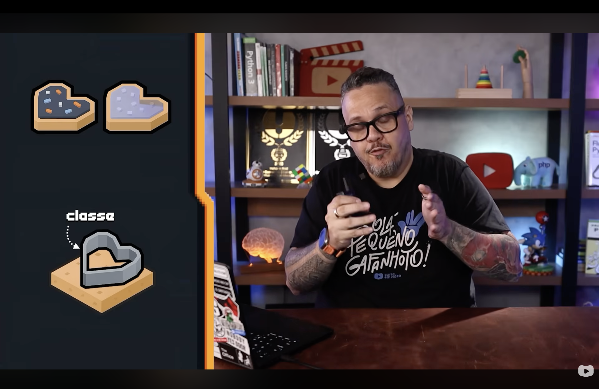
</p>

Antes de existir qualquer biscoito, existe o **cortador** — o molde metálico em formato de coração que corta a massa sempre com o mesmo contorno. Esse cortador é a **classe**: não é o biscoito em si, é a "planta" que define o formato que todo biscoito cortado com ele vai ter. A classe não se come; ela só define a forma.

<h2 align="left" id="4-estrutura">🧱 4. A estrutura de uma classe</h2>

<p align="center">
  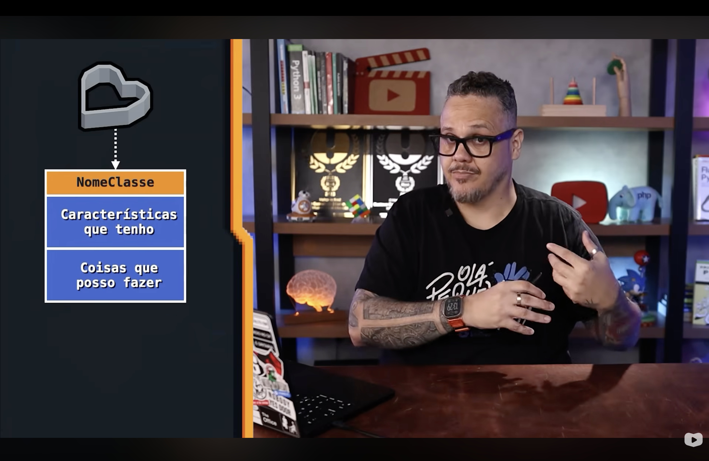
</p>

Traduzindo o cortador de biscoitos para um diagrama, toda classe segue o mesmo esqueleto de três blocos.

| Bloco 🎲 | Pergunta que responde ✏️ |
|---|---|
| **NomeClasse** | Como essa "coisa" se chama? |
| **Características que tenho** | O que eu **sou** — meus dados |
| **Coisas que posso fazer** | O que eu **faço** — minhas ações |

<h2 align="left" id="5-atributos-metodos">🏷️ 5. Atributos e métodos</h2>

<p align="center">
  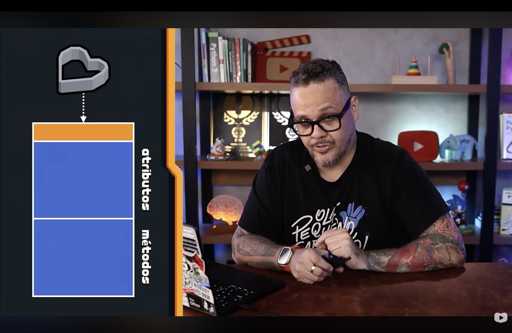
</p>

O mesmo diagrama recebe agora os nomes técnicos que a POO usa para as duas linhas de baixo — o mesmo vocabulário já apresentado em [PYTHON_E_POO.md](PYTHON_E_POO.md#5-fundamentacao).

| Bloco genérico 🎲 | Nome técnico ✏️ |
|---|---|
| Características que tenho | **Atributos** |
| Coisas que posso fazer | **Métodos** |

<h2 align="left" id="6-exemplo">📋 6. Exemplo completo: a classe BiscoitoCoracao</h2>

<p align="center">
  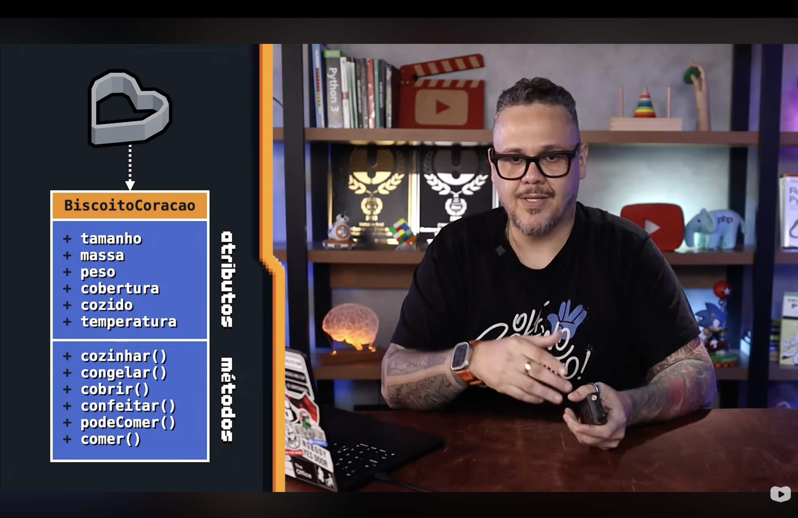
</p>

O esqueleto genérico ganha nome e conteúdo: a classe `BiscoitoCoracao`.

| Atributos🔨 | Métodos⛏️ |
|---|---|
| `tamanho` | `cozinhar()` |
| `massa` | `congelar()` |
| `peso` | `cobrir()` |
| `cobertura` | `confeitar()` |
| `cozido` | `podeComer()` |
| `temperatura` | `comer()` |

```python
class BiscoitoCoracao:
    def __init__(self, tamanho, massa, peso, cobertura, cozido, temperatura):
        self.tamanho = tamanho
        self.massa = massa
        self.peso = peso
        self.cobertura = cobertura
        self.cozido = cozido
        self.temperatura = temperatura

    def cozinhar(self):
        self.cozido = True

    def congelar(self):
        self.temperatura = -18

    def cobrir(self):
        self.cobertura = "chocolate"

    def confeitar(self):
        pass

    def podeComer(self):
        return self.cozido and self.temperatura < 60

    def comer(self):
        if (self.podeComer()_:
            print("Delícia!")
```

<h2 align="left" id="7-instanciar">🥮 7. Instância e instanciar</h2>

<p align="center">
  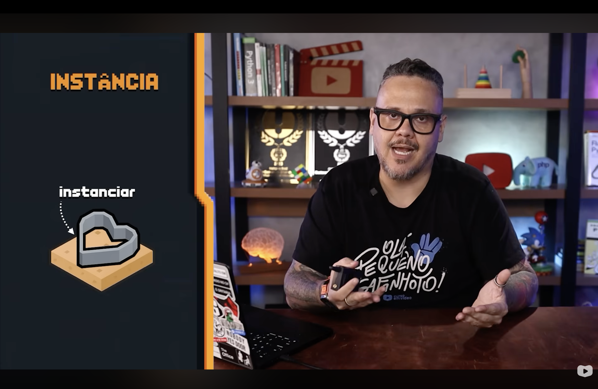
</p>

Cortar a massa com o cortador de biscoitos é o ato de **instanciar**: usar a classe (o cortador) para produzir uma unidade concreta (o biscoito de massa crua). Em Python, instanciar é chamar a classe como se fosse uma função — `BiscoitoCoracao(...)` — o que dispara o `__init__` e devolve um objeto novo.

<h2 align="left" id="8-classe-objeto">🔀 8. Classe vs. objeto, lado a lado</h2>

<p align="center">
  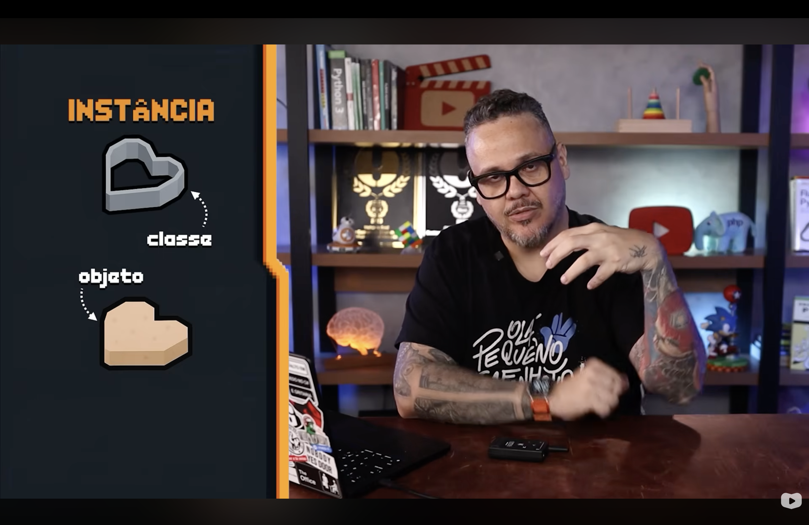
</p>

<p align="center">
  
</p>

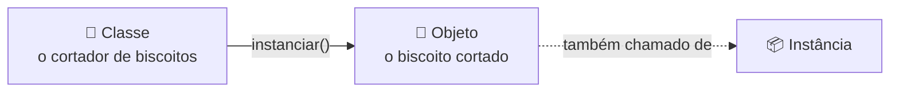

> "Um **objeto** é a **instância** de uma **classe**."

| Termo✏️ | O que é? | Na analogia🧬 |
|---|---|---|
| **Classe** | O molde que define o formato | O cortador de biscoitos |
| **Objeto** | Uma unidade concreta criada a partir da classe | O biscoito cortado |
| **Instância** | Sinônimo de objeto — o resultado do ato de instanciar | O mesmo biscoito, sob outro nome |

<h2 align="left" id="9-definicao-objeto">📖 9. Definição: o que é um objeto?</h2>

<p align="center">
  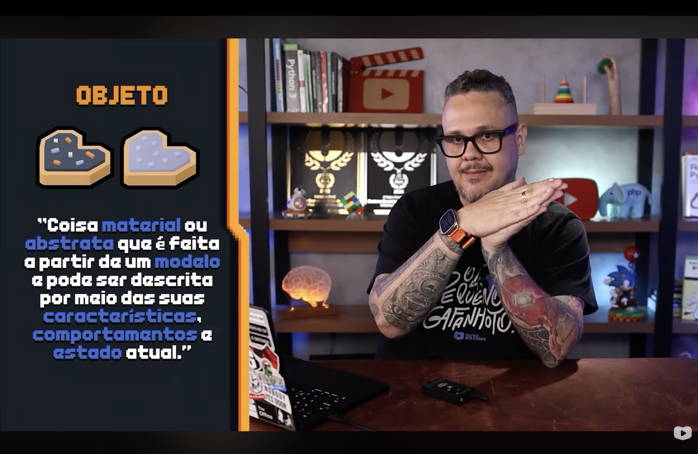
</p>

> "**Objeto**: coisa material ou abstrata que é feita a partir de um **modelo** e pode ser descrita por meio das suas **características**, **comportamentos** e **estado atual**."

Essa é a definição formal que fecha o ciclo: todo objeto (1) nasce de um modelo — a classe —, (2) tem características — os atributos —, (3) tem comportamentos — os métodos — e (4) tem um estado atual — os valores que os atributos assumem *naquele instante*.

<h2 align="left" id="10-estado">📊 10. Estado: os valores de um objeto em um dado momento</h2>

<p align="center">
  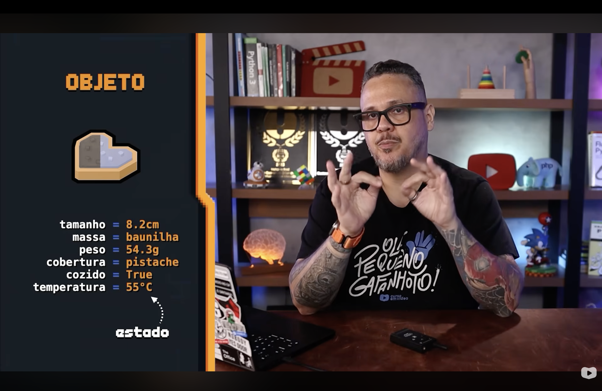
</p>

Enquanto a classe `BiscoitoCoracao` só define **quais** atributos existem, cada objeto criado a partir dela carrega seus **próprios valores** para esses atributos — e é esse conjunto de valores, em um dado momento, que se chama **estado**.

```python
tamanho = 8.2      
# cm
massa = "baunilha"
peso = 54.3         
# g
cobertura = "pistache"
cozido = True
temperatura = 55    
# °C
```

```python
biscoito1 = BiscoitoCoracao(8.2, "baunilha", 54.3, "pistache", True, 55)
biscoito1.congelar() # muda o estado: temperatura passa a -18
```

Dois objetos criados pela mesma classe (dois biscoitos cortados com o mesmo cortador) podem ter estados completamente diferentes — um assado, outro cru; um com cobertura de pistache, outro sem cobertura nenhuma. A classe é única; os estados dos objetos, não.

<h2 align="left" id="11-abstratos">💭 11. Objetos abstratos</h2>

<p align="center">
  
</p>

Nem todo objeto é "material" como um biscoito — a própria definição da [seção 9](#9-definicao-objeto) já previa isso ("coisa material **ou abstrata**"). Sistemas reais modelam constantemente coisas que não se podem tocar.

| Objeto abstrato💭 | Por que é um objeto? |
|---|---|
| Uma **consulta** marcada no médico | Tem características (data, horário, especialidade) e comportamentos (remarcar, cancelar) |
| Um **processo de venda** | Tem estado (aberto, fechado) e comportamentos (aprovar, recusar) |
| Um **compromisso ou reunião** | Tem participantes, horário, pauta |
| Uma **aula na faculdade** | Tem professor, sala, carga horária |
| Uma **transação bancária** | Tem valor, origem, destino, status |
| Uma **reserva de voo** | Tem assento, data, passageiro |
| Um **erro do sistema** | Tem código, mensagem, stack trace |

Isso importa porque a maior parte do código orientado a objetos do dia a dia não modela biscoitos — modela exatamente esse tipo de entidade abstrata do domínio de um sistema.

<h2 align="left" id="12-resumo">📌 12. Resumo final</h2>

```
┌────────────────────────────────────────────────────────────────┐
│  CLASSES, OBJETOS E INSTÂNCIAS                                   │
├────────────────────────────────────────────────────────────────┤
│  🧬 classe      → o cortador de biscoitos: define o formato        │
│  🍪 objeto      → o biscoito cortado: uma unidade concreta         │
│  📦 instância   → sinônimo de objeto; instanciar = cortar a massa  │
│  🏷️ atributos   → características que o objeto tem                 │
│  ⚙️ métodos     → coisas que o objeto pode fazer                    │
│  📊 estado      → os valores dos atributos em um dado momento      │
│  💭 objeto      → pode ser material (biscoito) ou abstrato (venda) │
└────────────────────────────────────────────────────────────────┘
```

> 🎓 **Conclusão:** a mesma classe `BiscoitoCoracao` corta infinitos biscoitos com o mesmo formato — e infinitos estados diferentes. É essa distinção entre **molde único** e **objetos com estado próprio** que sustenta a definição de [PYTHON_E_POO.md](PYTHON_E_POO.md#5-fundamentacao): classe é a planta, objeto/instância é o que se constrói a partir dela, atributos são o estado, métodos são o comportamento — e nem todo objeto precisa caber na mão para existir .