<h1 align="center">
  Curso em Video - Python Mundo 4 <br> De Onde Veio a POO — Contexto Histórico <br>
  🕰️🧬
</h1>

<p align="center">
  
</p>

<p align="center">
    
    
    
    
    
    
</p>

>Aprofundamento da seção *"Embasamento: de onde veio a POO"* do [PYTHON_E_POO.md](PYTHON_E_POO.md) — a linha do tempo completa que liga a **crise do software dos anos 1960** à evolução das linguagens de programação até chegar às **linguagens orientadas a objetos**, a Smalltalk e, por fim, ao **Python**. 

<h2 align="left">🧭 Sumário: </h2>

1. [As perguntas que abrem o tema](#1-perguntas)
2. [POO ou OOP: representar o mundo real em objetos](#2-poo-oop)
3. [Mas de onde veio tudo isso?](#3-de-onde-veio)
4. [A crise do software de 1960](#4-crise-do-software)
5. [Necessidade é a mãe da invenção](#5-citacoes)
6. [O mundo já era feito de "objetos"](#6-mundo-de-objetos)
7. [Linha do tempo: da linguagem de máquina à POO](#7-linha-do-tempo)
8. [Smalltalk, Alan Kay e o nascimento do Python](#8-smalltalk-python)
9. [Nomenclaturas: OOP e OOAD](#9-oop-ooad)
10. [Estrutura de imagens deste documento](#10-estrutura)
11. [Resumo final](#11-resumo)

<h2 align="left" id="1-perguntas">❓ 1. As perguntas que abrem o tema</h2>

Antes de qualquer definição, o próprio material provoca quatro perguntas — que são o roteiro deste documento.

<p align="center">
  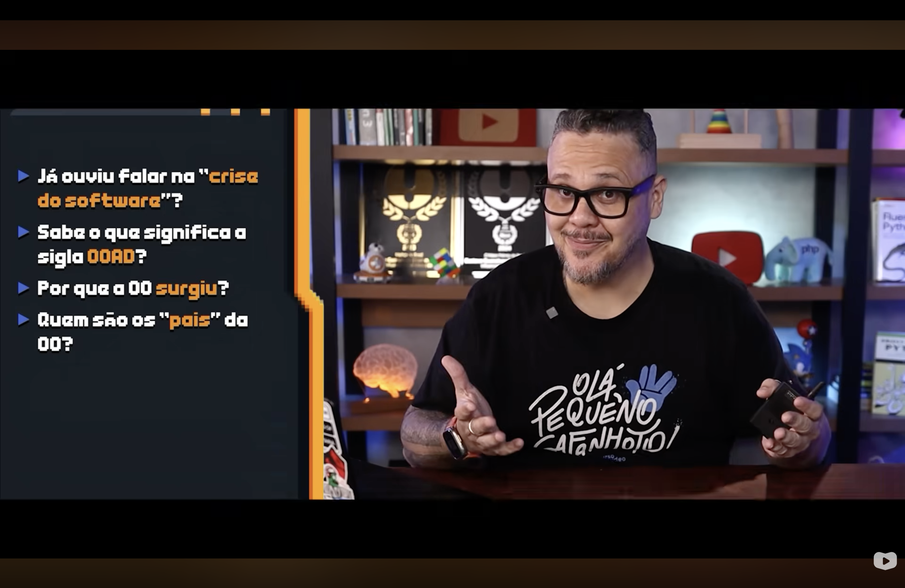
</p>

| Pergunta | Onde é respondida aqui |
|---|---|
| Já ouviu falar na "crise do software"? | [Seção 4](#4-crise-do-software) |
| Sabe o que significa a sigla `OOAD`? | [Seção 9](#9-oop-ooad) |
| Por que a OO surgiu? | [Seções 4](#4-crise-do-software), [6](#6-mundo-de-objetos) e [7](#7-linha-do-tempo) |
| Quem são os "pais" da OO? | [Seções 7](#7-linha-do-tempo) e [8](#8-smalltalk-python) |

<p align="center">
  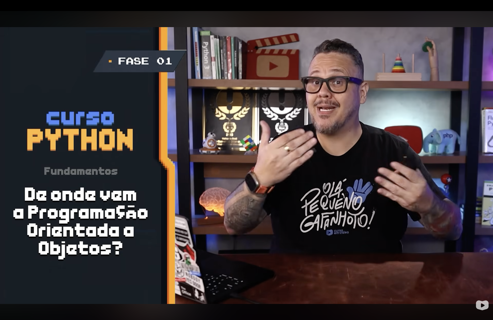
</p>

<h2 align="left" id="2-poo-oop">🔤 2. POO ou OOP: representar o mundo real em objetos</h2>

<p align="center">
  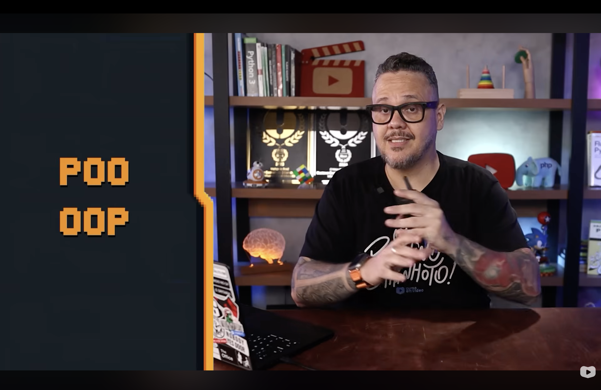
</p>

A ideia central, antes de qualquer sigla, é simples:

<p align="center">
  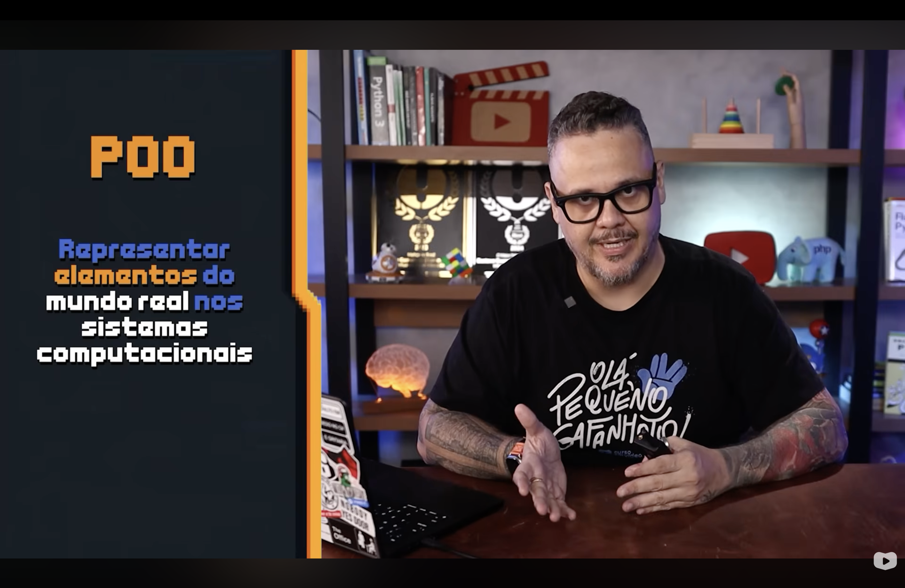
</p>

<p align="center">
  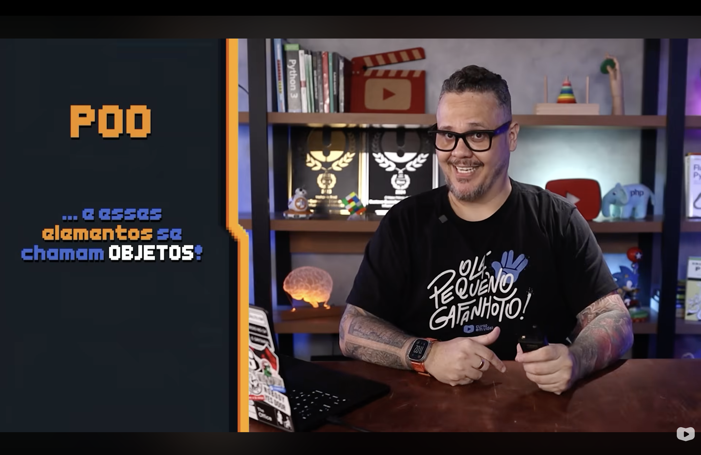
</p>

| Sigla | Ideia |
|---|---|
| `POO` | Representar **elementos do mundo real** dentro de sistemas computacionais |
| *(e esses elementos...)* | ...se chamam **objetos** — a peça central de todo o paradigma |

<h2 align="left" id="3-de-onde-veio">🕰️ 3. Mas de onde veio tudo isso?</h2>

<p align="center">
  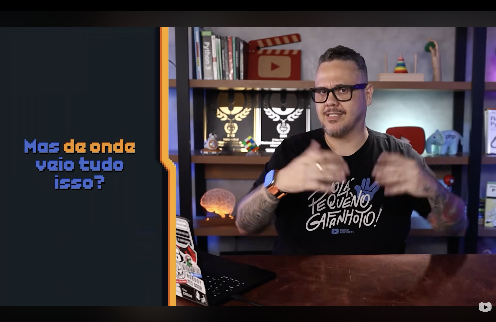
</p>

A resposta não começa com uma linguagem de programação — começa com um **problema real da indústria de software** no fim dos anos 1960.

<h2 align="left" id="4-crise-do-software">⚠️ 4. A crise do software de 1960</h2>

<p align="center">
  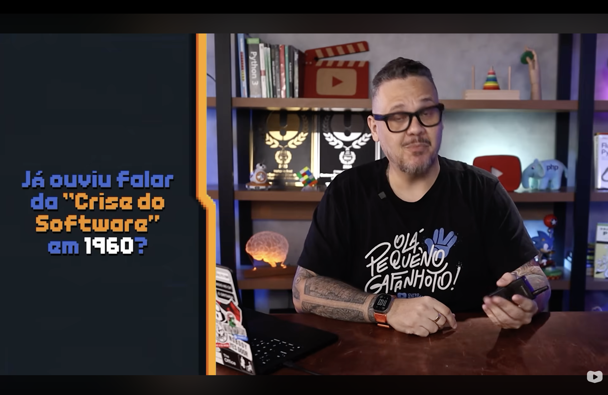
</p>

Na virada para os anos 1960, o hardware evoluía rápido e passou a suportar sistemas cada vez mais ambiciosos — só que a forma de escrever software não acompanhava esse salto. Projetos estouravam prazo e orçamento, software ficava cheio de bugs e difícil de manter, e a complexidade dos sistemas cresceu mais rápido do que a capacidade humana de organizá-los com as técnicas da época (linguagens de baixo nível, código linear, sem estruturação). Esse cenário ficou conhecido como **"crise do software"** — e é o gatilho histórico que empurra a evolução das linguagens de programação, década após década, até chegar à orientação a objetos.

<h2 align="left" id="5-citacoes">💬 5. Necessidade é a mãe da invenção</h2>

<p align="center">
  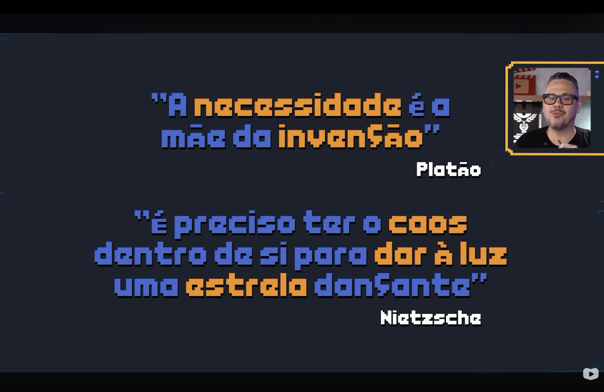
</p>

| Citação | Autor | Leitura no contexto da POO |
|---|---|---|
| "A necessidade é a mãe da invenção" | Platão | A POO não nasceu de teoria pura — nasceu da **necessidade prática** de domar a crise do software |
| "É preciso ter o caos dentro de si para dar à luz uma estrela dançante" | Nietzsche | Da **desorganização** do código procedural em sistemas grandes nasceu a organização em objetos |

<h2 align="left" id="6-mundo-de-objetos">🧸 6. O mundo já era feito de "objetos"</h2>

<p align="center">
  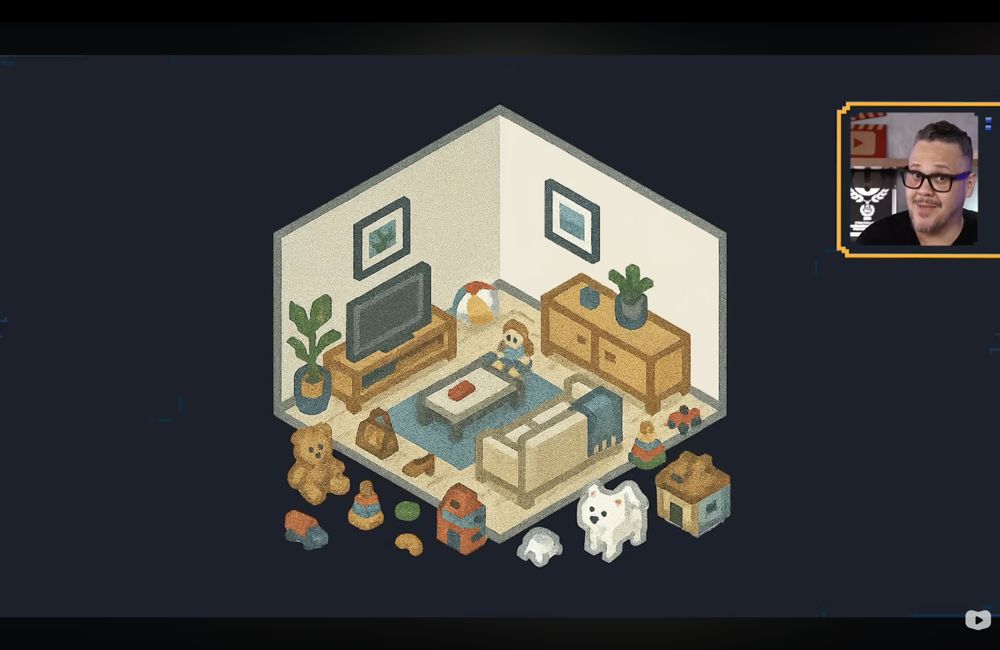
</p>

A virada de chave da POO é perceptual: olhando ao redor — uma sala, uma casa, uma cidade — tudo já é naturalmente organizado em **objetos** com características (atributos) e comportamentos próprios (métodos): um cachorro late, uma TV liga, um ursinho de pelúcia é macio. A POO propõe representar sistemas computacionais do mesmo jeito que a mente humana já organiza o mundo real — em vez de forçar o problema a caber em funções soltas e dados avulsos.

<h2 align="left" id="7-linha-do-tempo">📈 7. Linha do tempo: da linguagem de máquina à POO</h2>

Cada geração de linguagens resolveu parte do problema da "crise do software" e abriu caminho para a próxima.

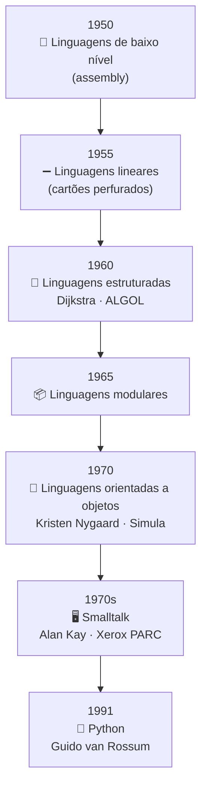
```mermaid
flowchart TD
    A["1950<br/>🔩 Linguagens de baixo nível<br/>(assembly)"] --> B["1955<br/>➖ Linguagens lineares<br/>(cartões perfurados)"]
    B --> C["1960<br/>🧱 Linguagens estruturadas<br/>Dijkstra · ALGOL"]
    C --> D["1965<br/>📦 Linguagens modulares"]
    D --> E["1970<br/>🧬 Linguagens orientadas a objetos<br/>Kristen Nygaard · Simula"]
    E --> F["1970s<br/>🖥️ Smalltalk<br/>Alan Kay · Xerox PARC"]
    F --> G["1991<br/>🐍 Python<br/>Guido van Rossum"]
```

<p align="center">
  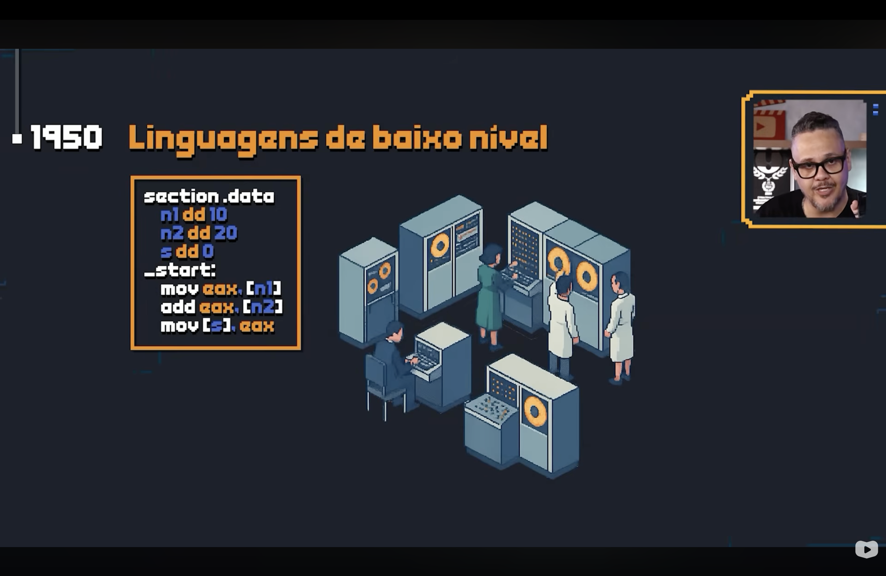
</p>

| Ano | Geração | O que muda |
|---|---|---|
| **1950** | Linguagens de **baixo nível** | Código próximo do hardware (assembly) — poderoso, mas ilegível e difícil de manter |

<p align="center">
  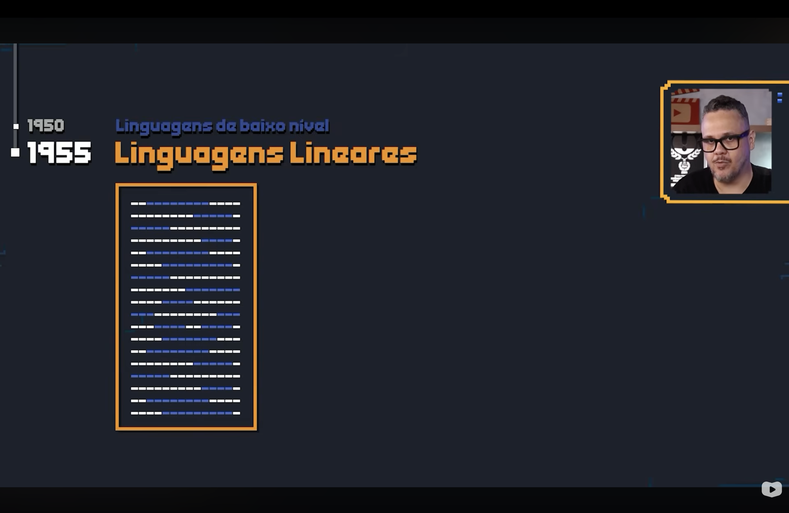
</p>

| Ano | Geração | O que muda |
|---|---|---|
| **1955** | Linguagens **lineares** | Execução sequencial, linha após linha — ainda sem blocos ou estruturas de controle organizadas |

<p align="center">
  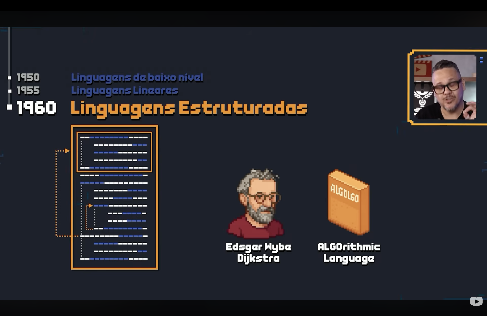
</p>

| Ano | Geração | Nome | O que muda |
|---|---|---|---|
| **1960** | Linguagens **estruturadas** | Edsger Wybe Dijkstra · `ALGOL` (*ALGOrithmic Language*) | Nascem os blocos de código, condicionais e laços organizados — a base da programação estruturada que os Mundos 1-3 deste curso já usam |

<p align="center">
  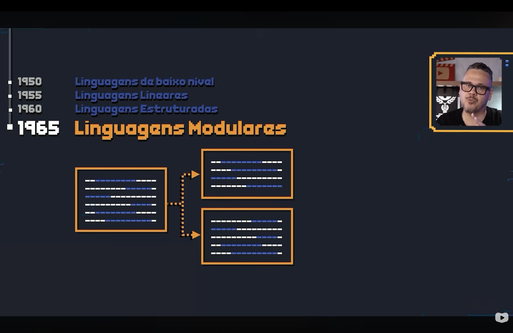
</p>

| Ano | Geração | O que muda |
|---|---|---|
| **1965** | Linguagens **modulares** | O código passa a ser dividido em **módulos** reutilizáveis e independentes — o mesmo espírito dos módulos e funções do Mundo 3 |

<p align="center">
  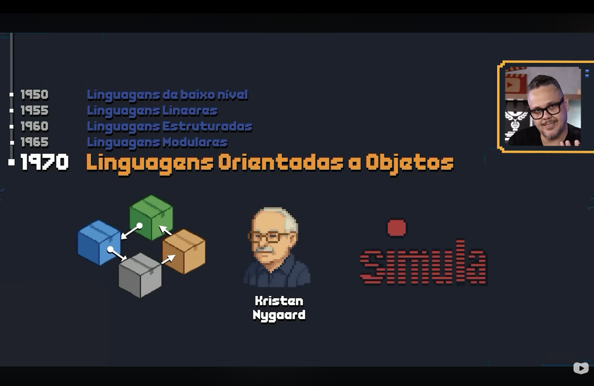
</p>

| Ano | Geração | Nome | O que muda |
|---|---|---|---|
| **1970** | Linguagens **orientadas a objetos** | Kristen Nygaard · `Simula` | Módulos passam a carregar dados **e** comportamento juntos, como unidades que se comunicam entre si — nasce a ideia de **objeto** como hoje se conhece |

<h2 align="left" id="8-smalltalk-python">🖥️ 8. Smalltalk, Alan Kay e o nascimento do Python</h2>

<p align="center">
  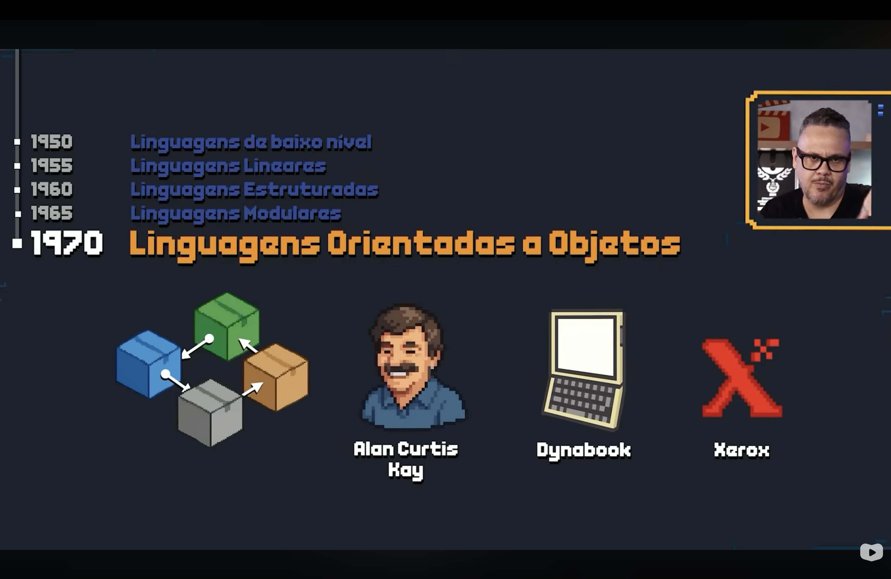
</p>

Depois de Simula, quem leva a POO adiante é **Alan Curtis Kay**, no **Xerox PARC**, com a visão do **Dynabook** — um computador pessoal conceitual pensado para todos, inclusive crianças. Para viabilizar essa visão, Kay ajuda a criar a linguagem **Smalltalk**, a primeira a levar a orientação a objetos "até o fim": nela, literalmente tudo — números, textos, estruturas — é um objeto que troca mensagens com outros objetos.

<p align="center">
  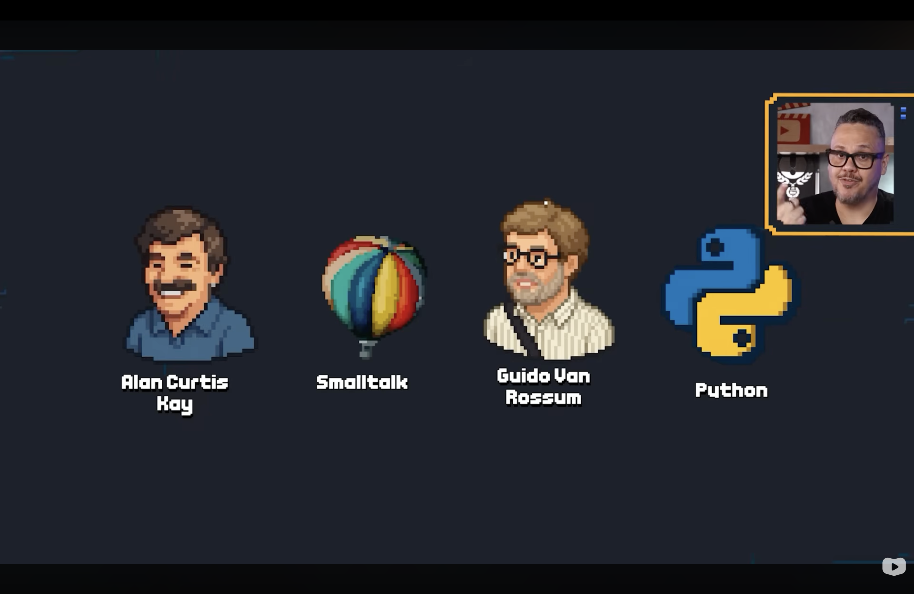
</p>

| Personagem | Criação | Legado para a POO |
|---|---|---|
| **Alan Curtis Kay** | `Smalltalk` (Xerox PARC, anos 1970) | Populariza os conceitos de objeto, mensagem e classe como hoje são usados |
| **Guido van Rossum** | `Python` (1991) | Herda a base orientada a objetos de linguagens como Smalltalk e C++, mas com sintaxe simples — o Python deste curso é a ponta mais recente dessa linha do tempo |

<h2 align="left" id="9-oop-ooad">🔠 9. Nomenclaturas: OOP e OOAD</h2>

<p align="center">
  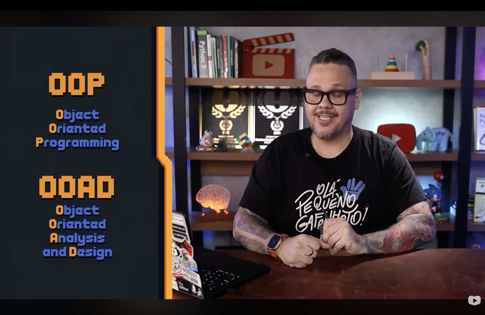
</p>

<p align="center">
  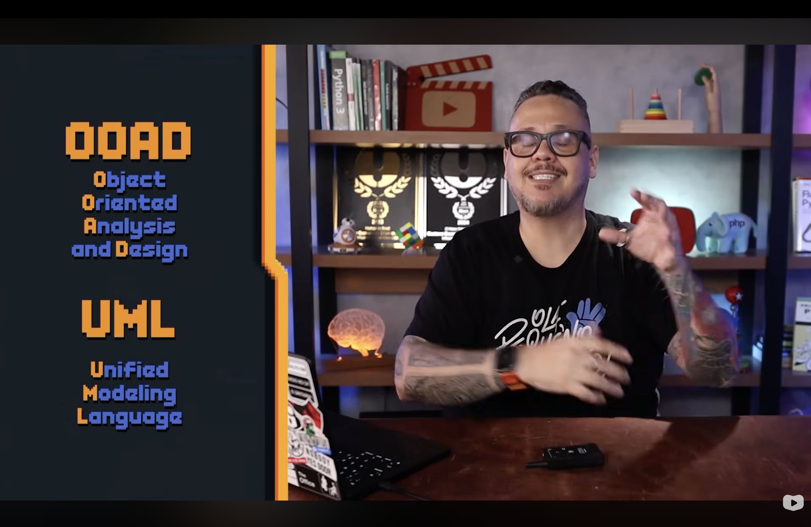
</p>

| Sigla | Significado (inglês) | O que é |
|---|---|---|
| `OOP` | *Object Oriented Programming* | Escrever o **código** em si usando classes e objetos — o equivalente a `POO` em português |
| `OOAD` | *Object Oriented Analysis and Design* | A etapa **anterior** ao código: analisar o domínio do problema e desenhar as classes antes de programar |
| `UML` | *Unified Modeling Language* | A notação gráfica padrão usada na etapa de `OOAD` para desenhar classes, relações e diagramas do sistema |

<h2 align="left" id="11-resumo">📌 10. Resumo final</h2>

```
┌────────────────────────────────────────────────────────────────┐
│  DE ONDE VEIO A POO                                              │
├────────────────────────────────────────────────────────────────┤
│  ⚠️ 1960: crise do software expõe os limites do código procedural │
│  📈 linha do tempo: baixo nível → linear → estruturada → modular  │
│  🧬 1970: Kristen Nygaard cria Simula, primeira linguagem OO      │
│  🖥️ Alan Kay leva a POO ao extremo com Smalltalk (Xerox PARC)     │
│  🐍 1991: Guido van Rossum cria Python sobre essa herança OO      │
│  🔠 OOP = código · OOAD = análise/design · UML = notação gráfica  │
└────────────────────────────────────────────────────────────────┘
```

> 🎓 **Conclusão:** a POO não foi inventada em uma sala de aula — foi a resposta da indústria a uma crise real de complexidade de software. Entender essa origem explica *por que* Python (e praticamente toda linguagem moderna) é orientada a objetos: é herança direta de uma linha que vai de Simula a Smalltalk até chegar aqui, no Mundo 4 .
