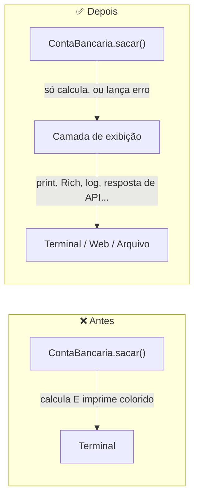

<h1 align="center">
  Curso em Video - Python Mundo 4 <br> Melhorando Objetos e Classes — <br>
  Do Funcional ao Robusto <br>
  🏦🔧
</h1>

<p align="center">
  
</p>

<p align="center">
    
    
    
    
    
</p>

>Continuação de [CLASSES_OBJETOS_INSTANCIAS.md](CLASSES_OBJETOS_INSTANCIAS.md) — depois de entender **o que** é uma classe, este documento parte da classe `ContaBancaria` implementada em [`117_conta_bancaria.py`](../117_conta_bancaria.py) para mostrar **como** deixar uma classe que já funciona mais robusta, testável e fácil de manter. 

<h2 align="left">🧭 Sumário: </h2>

1. [Por que "melhorar" uma classe que já funciona?](#1-porque)
2. [Ponto de partida: a classe ContaBancaria](#2-ponto-partida)
3. [Problema 1: encapsulamento — dá pra violar o saldo direto](#3-encapsulamento)
4. [Problema 2: falta de validação dos dados](#4-validacao)
5. [Problema 3: lógica de negócio grudada na apresentação](#5-srp)
6. [Problema 4: só existe __str__, falta __repr__](#6-repr)
7. [Problema 5: sem tipagem e com números mágicos](#7-tipagem)
8. [Problema 6: métodos que só imprimem são difíceis de testar](#8-testabilidade)
9. [Versão melhorada: ContaBancaria 2.0](#9-versao-melhorada)
10. [Tabela-resumo: antes vs. depois](#10-resumo-tabela)
11. [Próximo passo: separar a exibição com Rich](#11-proximo-passo)
12. [Resumo final](#12-resumo)

<h2 align="left" id="1-porque">❓ 1. Por que "melhorar" uma classe que já funciona?</h2>

A classe `ContaBancaria` de `117_conta_bancaria.py` **funciona**: cria conta, deposita, saca, mostra saldo. Para um exercício, está pronta. Mas "funcionar no caminho feliz" e "estar bem projetada" são coisas diferentes — o código atual quebra silenciosamente em vários cenários que um usuário real (ou um teste automatizado) vai encontrar mais cedo ou mais tarde. Melhorar uma classe não é reescrevê-la do zero: é revisar suas costuras — o que ela expõe, o que ela valida, e o que ela faz além do que deveria.

<h2 align="left" id="2-ponto-partida">🏦 2. Ponto de partida: a classe ContaBancaria</h2>

```python
from cores import *

class ContaBancaria:
    def __init__(self, id, titular, saldo=0):
        self.id = id
        self.titular = titular
        self.saldo = saldo

    def __str__(self):
        return f"""{CinzaClaro}O id da sua conta é: {self.id}, seu saldo é de: {Verde}R${Reset}{CinzaClaro}{self.saldo:.2f}\n
        Títular: {self.titular}{Reset}"""

    def depositar(self, valor):
        self.saldo += valor
        print(f"{CinzaClaro}O Depósito no valor de: {Verde}R${Reset}{CinzaClaro}{valor:.2f} foi autorizado✅{Reset}")

    def sacar(self, valor):
        if(valor > self.saldo):
            print(f"{Vermelho}Voce está tentando sacar {Verde}R${Reset}{CinzaClaro}{valor:.2f}{Vermelho}, mas seu saldo NÃO É suficiente!❌{Reset}")
        else:
            self.saldo -= valor
            print(f"{CinzaClaro}O Saque no valor de: {Verde}R${Reset}{CinzaClaro}{valor:.2f} foi autorizado✅{Reset}")
```

Seis problemas concretos moram nesse código — cada um com uma seção própria abaixo.

<h2 align="left" id="3-encapsulamento">🔓 3. Problema 1: encapsulamento — dá pra violar o saldo direto</h2>

`self.saldo` é um atributo público comum. Nada impede que qualquer código, em qualquer lugar do programa, ignore `sacar()` e `depositar()` e mexa direto no valor:

```python
conta1 = ContaBancaria(id=1, titular="Lucas Paguetti", saldo=3000)
conta1.saldo = -9999   
# nenhuma regra de negócio é executada; a conta agora está "quebrada"
```

Toda a validação que deveria existir em `sacar()` (não deixar saldo negativo) é opcional — só é aplicada se quem usa a classe **lembrar** de chamar o método certo. Isso é o oposto do que a POO promete: o objeto deveria proteger seu próprio estado.

**Como corrigir:** usar um atributo "protegido" por convenção (`_saldo`) e expor o valor somente para leitura através de uma `@property`. Quem quiser mudar o saldo é obrigado a passar pelos métodos que validam a operação.

```python
class ContaBancaria:
    def __init__(self, id, titular, saldo=0):
        self.id = id
        self.titular = titular
        self._saldo = saldo

    @property
    def saldo(self):
        return self._saldo
```

Agora `conta1.saldo` ainda funciona para leitura (`print(conta1.saldo)`), mas `conta1.saldo = -9999` levanta `AttributeError: can't set attribute` — a única porta de entrada para alterar o saldo continua sendo `depositar()` e `sacar()`.

> 💡 Em Python o prefixo `_saldo` é uma **convenção** ("não mexa aqui de fora"), não uma trava real. Já `__saldo` (dois underscores) ativa o *name mangling* e dificulta ainda mais o acesso acidental — mas para a maioria dos casos, `_saldo` + `@property` já resolve o problema sem exagerar na rigidez.

<h2 align="left" id="4-validacao">🚧 4. Problema 2: falta de validação dos dados</h2>

O `__init__` aceita qualquer coisa — inclusive um `saldo` inicial negativo, o que não faz sentido para uma conta nova:

```python
conta_invalida = ContaBancaria(id=2, titular="Erro", saldo=-500)  # aceito sem reclamar
```

E `depositar()` aceita valores negativos ou zero, o que na prática **saca** dinheiro disfarçado de depósito:

```python
conta1.depositar(valor=-1000)  # "deposita" -1000, ou seja, retira 1000 sem passar por sacar()
```

**Como corrigir:** validar as pré-condições logo no início de cada método, e recusar (levantando uma exceção) o que não faz sentido no domínio do problema.

```python
def __init__(self, id, titular, saldo=0):
    if saldo < 0:
        raise ValueError("Saldo inicial não pode ser negativo")
    self.id = id
    self.titular = titular
    self._saldo = saldo

def depositar(self, valor):
    if valor <= 0:
        raise ValueError("O valor do depósito deve ser positivo")
    self._saldo += valor
```

Um `raise` bem cedo é melhor do que deixar o objeto entrar num estado inconsistente e falhar (ou pior, "funcionar errado" silenciosamente) mais tarde, em outro lugar do código.

<h2 align="left" id="5-srp">🧵 5. Problema 3: lógica de negócio grudada na apresentação</h2>

Repare que `depositar()` e `sacar()` fazem duas coisas ao mesmo tempo: **calculam** o novo saldo **e** decidem **como imprimir** o resultado, cores ANSI incluídas. Isso viola o [Princípio da Responsabilidade Única](https://en.wikipedia.org/wiki/Single_responsibility_principle) (o "S" do SOLID): um método deveria ter um único motivo para mudar.

Consequências práticas desse acoplamento:

| Consequência | Por quê |
|---|---|
| **Difícil de testar** | Testar `sacar()` exige capturar o que foi impresso no terminal, em vez de simplesmente checar o novo saldo |
| **Difícil de reaproveitar** | Se amanhã a conta precisar rodar numa API web, os `print()` com códigos ANSI não fazem sentido nenhum lá |
| **Difícil de trocar a "casca" visual** | Migrar de `cores.py` para a biblioteca [Rich](BIBLIOTECA_RICH.md) exige reescrever a lógica de negócio junto, quando deveria exigir só trocar a exibição |

**Como corrigir:** os métodos só alteram o estado e **devolvem** informação (ou levantam exceção); quem chama decide como mostrar isso ao usuário.

```python
class SaldoInsuficienteError(Exception):
    """Levantado quando um saque excede o saldo disponível."""

def sacar(self, valor):
    if valor <= 0:
        raise ValueError("O valor do saque deve ser positivo")
    if valor > self._saldo:
        raise SaldoInsuficienteError(
            f"Saldo de R$ {self._saldo:.2f} é insuficiente para sacar R$ {valor:.2f}"
        )
    self._saldo -= valor
```

```python
# a decisão de "como mostrar" fica fora da classe, na camada de exibição
try:
    conta1.sacar(valor=2000)
    print(f"{Verde}Saque autorizado ✅{Reset}")
except SaldoInsuficienteError as erro:
    print(f"{Vermelho}{erro} ❌{Reset}")
```



<h2 align="left" id="6-repr">🪞 6. Problema 4: só existe __str__, falta __repr__</h2>

`__str__` já existe e define como `print(conta1)` aparece para o **usuário final** — mas Python distingue essa representação "amigável" da representação **inequívoca**, usada em debug, logs e no console interativo: `__repr__`. Sem ela, `repr(conta1)` (ou simplesmente digitar `conta1` no console) cai no padrão genérico do Python, que só mostra o endereço em memória — o mesmo problema já demonstrado em [`117_teste_classe.py`](../117_teste_classe.py) para a classe `Pessoa` sem `__str__`.

```python
def __repr__(self):
    return f"ContaBancaria(id={self.id!r}, titular={self.titular!r}, saldo={self._saldo!r})"

def __str__(self):
    return f"Conta #{self.id} de {self.titular}: R$ {self._saldo:.2f}"
```

| Método | Público-alvo | Objetivo | Exemplo de saída |
|---|---|---|---|
| `__repr__` | Desenvolvedor(a) depurando o código | Ser inequívoco — se possível, reconstruível | `ContaBancaria(id=1, titular='Lucas', saldo=3500.0)` |
| `__str__` | Usuário final lendo a tela | Ser legível e amigável | `Conta #1 de Lucas: R$ 3500.00` |

> 📌 Regra prática: implemente sempre `__repr__`; implemente `__str__` só quando a versão "amigável" for realmente diferente da de debug. Se só `__repr__` existir, `print()` usa `__repr__` como substituto automaticamente.

<h2 align="left" id="7-tipagem">🏷️ 7. Problema 5: sem tipagem e com números mágicos</h2>

`def __init__(self, id, titular, saldo=0):` não diz, só de olhar, que `id` é `int`, `titular` é `str` e `saldo` é numérico. *Type hints* tornam essas expectativas explícitas — e permitem que o editor e ferramentas como `mypy` avisem sobre erros **antes** de rodar o código:

```python
def __init__(self, id: int, titular: str, saldo: float = 0.0) -> None:
    ...

def depositar(self, valor: float) -> None:
    ...

def sacar(self, valor: float) -> None:
    ...
```

Type hints em Python **não** são checados em tempo de execução por padrão — eles são documentação viva mais um contrato que ferramentas externas conseguem validar. Não substituem a validação feita com `raise` na [seção 4](#4-validacao); complementam.

<h2 align="left" id="8-testabilidade">🧪 8. Problema 6: métodos que só imprimem são difíceis de testar</h2>

Juntando os problemas anteriores, o resultado prático aparece na hora de escrever um teste automatizado. Com a classe original, testar exige capturar `stdout`:

```python
# difícil e frágil: o teste depende do texto exato impresso, cores ANSI incluídas
```

Com os métodos retornando/validando estado em vez de imprimir, o teste vira trivial:

```python
def test_saque_com_saldo_insuficiente():
    conta = ContaBancaria(id=1, titular="Lucas", saldo=100)
    try:
        conta.sacar(valor=500)
        assert False, "deveria ter levantado SaldoInsuficienteError"
    except SaldoInsuficienteError:
        assert conta.saldo == 100  # saldo não foi alterado
```

Um objeto fácil de testar quase sempre é também um objeto bem projetado — não por coincidência: os dois vêm da mesma causa, responsabilidades bem separadas.

<h2 align="left" id="9-versao-melhorada">✅ 9. Versão melhorada: ContaBancaria 2.0</h2>

Juntando as seis correções:

```python
class SaldoInsuficienteError(Exception):
    """Levantado quando um saque excede o saldo disponível."""


class ContaBancaria:
    def __init__(self, id: int, titular: str, saldo: float = 0.0) -> None:
        if saldo < 0:
            raise ValueError("Saldo inicial não pode ser negativo")
        self.id = id
        self.titular = titular
        self._saldo = saldo

    @property
    def saldo(self) -> float:
        return self._saldo

    def __repr__(self) -> str:
        return f"ContaBancaria(id={self.id!r}, titular={self.titular!r}, saldo={self._saldo!r})"

    def __str__(self) -> str:
        return f"Conta #{self.id} de {self.titular}: R$ {self._saldo:.2f}"

    def depositar(self, valor: float) -> None:
        if valor <= 0:
            raise ValueError("O valor do depósito deve ser positivo")
        self._saldo += valor

    def sacar(self, valor: float) -> None:
        if valor <= 0:
            raise ValueError("O valor do saque deve ser positivo")
        if valor > self._saldo:
            raise SaldoInsuficienteError(
                f"Saldo de R$ {self._saldo:.2f} é insuficiente para sacar R$ {valor:.2f}"
            )
        self._saldo -= valor
```

A lógica de negócio agora não sabe nada sobre `cores.py` nem sobre terminal — ela só sabe somar, subtrair e recusar operações inválidas. Quem chama a classe decide como exibir o resultado (com `cores.py`, com [Rich](BIBLIOTECA_RICH.md), num log, numa resposta HTTP...).

<h2 align="left" id="10-resumo-tabela">📊 10. Tabela-resumo: antes vs. depois</h2>

| Aspecto | Antes (117_conta_bancaria.py) | Depois (ContaBancaria 2.0) |
|---|---|---|
| **Saldo** | Atributo público, editável de fora sem regra alguma | `_saldo` protegido + `@property` só-leitura |
| **Saldo inicial negativo** | Aceito sem aviso | `raise ValueError` no `__init__` |
| **Depósito/saque com valor ≤ 0** | Aceito, quebra a regra de negócio | `raise ValueError` |
| **Saque maior que o saldo** | `print()` de erro, saldo não muda | `raise SaldoInsuficienteError`, saldo não muda |
| **Apresentação (cores)** | Dentro dos métodos de negócio | Fora da classe, na camada de exibição |
| **`__repr__`** | Não existe | Representação inequívoca para debug |
| **Tipagem** | Nenhuma | Type hints em todos os parâmetros e retornos |
| **Testabilidade** | Exige capturar `stdout` | Testa estado e exceções diretamente |

<h2 align="left" id="11-proximo-passo">🎨 11. Próximo passo: separar a exibição com Rich</h2>

A [seção 5](#5-srp) mostrou que tirar a formatação colorida de dentro da classe é o que abre espaço para trocar **como** o resultado aparece sem tocar em **como** ele é calculado. O documento [BIBLIOTECA_RICH.md](BIBLIOTECA_RICH.md) mostra como usar a biblioteca [Rich](https://github.com/Textualize/rich) — a mesma usada em [`118.py`](../118.py) — para exibir esse mesmo `ContaBancaria` em um `Panel` ou numa `Table`, sem misturar uma linha de negócio com uma linha de estilo.

<h2 align="left" id="12-resumo">📌 12. Resumo final</h2>

```
┌──────────────────────────────────────────────────────────────────┐
│  MELHORANDO OBJETOS E CLASSES                                     │
├──────────────────────────────────────────────────────────────────┤
│  🔓 encapsulamento → _saldo + @property no lugar de atributo livre │
│  🚧 validação      → raise cedo em vez de aceitar qualquer valor   │
│  🧵 SRP            → calcular ≠ exibir; classe não imprime nada    │
│  🪞 __repr__        → representação inequívoca, separada de __str__ │
│  🏷️ tipagem         → type hints documentam o contrato dos métodos  │
│  🧪 testabilidade  → estado e exceções testáveis sem capturar print │
└──────────────────────────────────────────────────────────────────┘
```

> 🎓 **Conclusão:** melhorar uma classe raramente é reescrevê-la — é revisar o que ela expõe (encapsulamento), o que ela aceita (validação), o que ela faz de mais (responsabilidade única) e o que ela comunica (`__repr__`, tipagem). O resultado é o mesmo comportamento de antes, só que mais difícil de usar errado .
