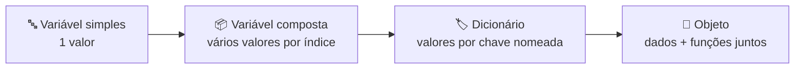
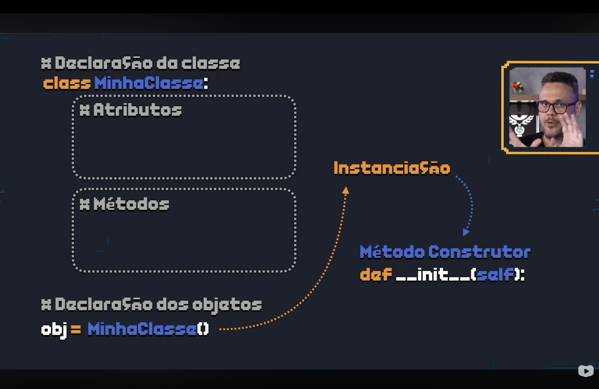

<h1 align="center">
  Curso em Video - Python Mundo 4 <br> Objetos são Variáveis Evoluídas <br>
  🧬📦
</h1>

<p align="center">
  
</p>

<p align="center">
    
    
    
    
    
    
</p>

>Aprofundamento da seção *"Fundamentação: os conceitos da POO"* do [PYTHON_E_POO.md](PYTHON_E_POO.md#5-fundamentacao) — a **Fase 04** do curso, que chega na definição de objeto por outro caminho: em vez de partir da analogia (o molde e o biscoito, já vista em [CLASSES_OBJETOS_INSTANCIAS.md](CLASSES_OBJETOS_INSTANCIAS.md)), parte do que já é familiar dos Mundos 1 a 3 — a variável — e mostra como ela **evolui** até virar um objeto. 

<h2 align="left">🧭 Sumário: </h2>

1. [Perguntas que essa fase responde](#1-perguntas)
2. [Título: os objetos são variáveis evoluídas](#2-titulo)
3. [Ponto de partida: a variável simples](#3-variavel-simples)
4. [Primeira evolução: variáveis compostas](#4-variaveis-compostas)
5. [Segunda evolução: dicionários com elementos nomeados](#5-dicionarios)
6. [O problema: dados e funções vivem separados](#6-problema)
7. [A solução: dados + funções na mesma variável](#7-solucao)
8. [Definição: o que é um objeto](#8-definicao)
9. [Objetos, em outras palavras](#9-reformulacao)
10. [Mão na massa: a sintaxe de classe e objeto](#10-sintaxe)
11. [Resumo final](#11-resumo)

<h2 align="left" id="1-perguntas">❓ 1. Perguntas que essa fase responde</h2>

<p align="center">
  
</p>

Antes de qualquer definição, a Fase 04 lista as perguntas que um iniciante realmente faz ao ouvir falar de POO pela primeira vez.

| Pergunta ❓ | Onde é respondida nesta página |
|---|---|
| Qual é a diferença entre objeto e variável? | Seções [3](#3-variavel-simples) a [9](#9-reformulacao) |
| Quando vamos colocar a mão na massa? | Seção [10](#10-sintaxe) |
| Como faço pra declarar uma classe? | Seção [10](#10-sintaxe) |
| Como instancio um objeto a partir de uma classe? | Seção [10](#10-sintaxe) |

<h2 align="left" id="2-titulo">🎬 2. Título: os objetos são variáveis evoluídas</h2>

<p align="center">
  
</p>

A tese da fase é direta: **objeto não é um conceito novo e isolado** — é uma variável comum (das que já foram usadas centenas de vezes nos Mundos 1 a 3) que passou por uma série de evoluções até ganhar uma capacidade que uma variável simples nunca teve.

<h2 align="left" id="3-variavel-simples">🔤 3. Ponto de partida: a variável simples</h2>

<p align="center">
  
</p>

Toda variável simples guarda **um único valor por vez** — esse valor é o seu **estado** naquele instante.

```python
uf = "SP"
print(uf)   # estado atual: "SP"
```

Atribuir um novo valor não altera o `"SP"` que já existia — ele simplesmente é **substituído**. A variável não tem memória do valor anterior, nem forma de guardar os dois ao mesmo tempo.

<p align="center">
  
</p>

```python
uf = "RJ"
uf = "SP"   # "RJ" é perdido; o estado agora é só "SP"
print(uf)   # "SP"
```

<h2 align="left" id="4-variaveis-compostas">📦 4. Primeira evolução: variáveis compostas</h2>

<p align="center">
  
</p>

A primeira evolução resolve exatamente essa limitação: uma variável composta (lista) guarda **vários estados ao mesmo tempo**, cada um acessível por um índice numérico.

```python
estados = ["RJ", "SP", "CE"]

print(estados[0])   # "RJ"
print(estados[1])   # "SP"
print(estados[2])   # "CE"
```

<p align="center">
  
</p>

O ganho é real — vários valores em uma única variável —, mas o acesso por **índice numérico** (`estados[2]`) não diz nada sobre o que aquele valor representa. É preciso lembrar de cabeça que a posição `2` é o Ceará.

<h2 align="left" id="5-dicionarios">🏷️ 5. Segunda evolução: dicionários com elementos nomeados</h2>

<p align="center">
  
</p>

A segunda evolução troca o índice numérico por uma **chave nomeada**: o dicionário. Cada valor passa a ter um rótulo que descreve o que ele é.

```python
aluno = {
    "nome": "José",
    "turma": 301,
    "nota": 8.5,
    "ativo": True,
}

print(aluno["nome"])   # "José"
print(aluno["nota"])   # 8.5
```

Já é bem mais legível que `estados[2]` — mas o dicionário ainda guarda **só dados**. Não existe, dentro dele, nenhuma forma de dizer "calcule a média do aluno" ou "aprove o aluno se a nota for suficiente". Isso ainda mora em outro lugar: em uma função separada.

<h2 align="left" id="6-problema">🧩 6. O problema: dados e funções vivem separados</h2>

<p align="center">
  
</p>

Com o vocabulário dos Mundos 1 a 3 (variáveis + funções), esse é o teto: os **dados** ficam em uma variável e o **comportamento** que opera sobre eles fica em funções soltas, em outro lugar do código. Nada os mantém unidos.

```python
aluno = {"nome": "José", "nota": 8.5}

def aprovar(aluno):
    return aluno["nota"] >= 6.0

def exibir_boletim(aluno):
    status = "aprovado" if aprovar(aluno) else "reprovado"
    print(f"{aluno['nome']}: {status}")

exibir_boletim(aluno)   
# a função precisa "vir buscar" o dicionário
```

Nada impede outra parte do código de alterar `aluno["nota"]` para um valor inválido, ou de esquecer de chamar `aprovar()` antes de usar o resultado — dados e regras não estão amarrados.

<h2 align="left" id="7-solucao">🔗 7. A solução: dados + funções na mesma variável</h2>

<p align="center">
  
</p>

A saída é permitir que a própria variável **carregue suas funções junto com os dados** — para que ela saiba, sozinha, o que fazer consigo mesma. Essa fusão (`dados + funções`) é exatamente o que a POO chama de **objeto**.

```python
class Aluno:
    def __init__(self, nome, nota):
        self.nome = nome   # dado
        self.nota = nota   # dado

    def aprovar(self): # função, agora dentro da variável
        return self.nota >= 6.0

    def reprovar(self):
        return self.nora <= 5.0
        print("reprovado")

    def exibir_boletim(self): # função, agora dentro da variável
        status = "aprovado" if self.aprovar() else self.reprovar()
        print(f"{self.nome}: {status}")

aluno1 = Aluno("José", 8.5)
aluno1.exibir_boletim() # o próprio objeto sabe se exibir
```

<h2 align="left" id="8-definicao">📖 8. Definição: o que é um objeto</h2>

<p align="center">
  
</p>

> "**Objeto**: assim, um **objeto** é uma **variável** que, além de guardar **dados**, pode executar **funcionalidades**."

<h2 align="left" id="9-reformulacao">🔁 9. Objetos, em outras palavras</h2>

<p align="center">
  
</p>

> "Em outras palavras, **objetos** são **variáveis** que, além de guardar **dados**, podem fazer **coisas** com esses dados."



| Etapa da evolução | O que guarda | O que ainda falta |
|---|---|---|
| Variável simples | 1 valor | Guardar mais de um valor |
| Variável composta (lista) | vários valores, por índice | Nomear cada valor |
| Dicionário | vários valores, por chave nomeada | Executar ações sobre os dados |
| **Objeto** | dados **+** funções | — é o destino final dessa evolução |

<h2 align="left" id="10-sintaxe">⌨️ 10. Mão na massa: a sintaxe de classe e objeto</h2>

<p align="center">
  
</p>

Com o "porquê" resolvido, a fase fecha com o "como": a sintaxe Python para declarar a classe (o molde) e, a partir dela, os objetos.

<p align="center">
  
</p>

```python
# Declaração da classe
class MinhaClasse:
    # Atributos e métodos ficam aqui dentro

    def __init__(self): # método construtor
        pass # roda automaticamente na instanciação


# Declaração do objeto — instanciar é chamar a classe como uma função
obj = MinhaClasse()
```

| Termo do diagrama | O que faz |
|---|---|
| `class MinhaClasse:` | Declara a classe — o molde |
| Atributos | Os dados que cada objeto vai guardar |
| Métodos | As funções que cada objeto vai poder executar |
| `def __init__(self):` | O **método construtor** — roda sozinho sempre que um objeto é criado |
| `obj = MinhaClasse()` | Declara o objeto — a **instanciação**, que dispara o `__init__` |

> 🍪 A mesma sintaxe, agora com nomes reais e a analogia do cortador de biscoitos, em [CLASSES_OBJETOS_INSTANCIAS.md](CLASSES_OBJETOS_INSTANCIAS.md).
>
> 💻 Primeiro exercício prático aplicando essa sintaxe: [`116.py`](../116.py).

<h2 align="left" id="11-resumo">📌 11. Resumo final</h2>

```
┌────────────────────────────────────────────────────────────────┐
│  OBJETOS SÃO VARIÁVEIS EVOLUÍDAS                                  │
├────────────────────────────────────────────────────────────────┤
│  🔤 variável simples    → 1 valor, 1 estado                        │
│  📦 variável composta   → vários valores, por índice numérico      │
│  🏷️ dicionário          → vários valores, por chave nomeada         │
│  🧩 problema            → dados e funções vivem separados          │
│  🔗 solução             → juntar dados + funções na mesma variável  │
│  🧬 objeto              → o resultado dessa junção                 │
│  🏛️ classe              → o molde que declara atributos e métodos   │
│  ⚙️ __init__            → método construtor, roda na instanciação   │
└────────────────────────────────────────────────────────────────┘
```

> 🎓 **Conclusão:** o caminho até aqui não introduziu nenhum conceito mágico — apenas evoluiu, passo a passo, algo que já era familiar desde o Mundo 1. Variável simples vira lista, lista vira dicionário, e dicionário vira objeto assim que ganha a capacidade de agir sobre os próprios dados. É esse mesmo objeto, construído com `class` e instanciado com `MinhaClasse()`, que sustenta a definição formal de [PYTHON_E_POO.md](PYTHON_E_POO.md#5-fundamentacao) e a analogia do biscoito em [CLASSES_OBJETOS_INSTANCIAS.md](CLASSES_OBJETOS_INSTANCIAS.md) .