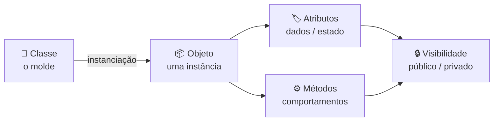
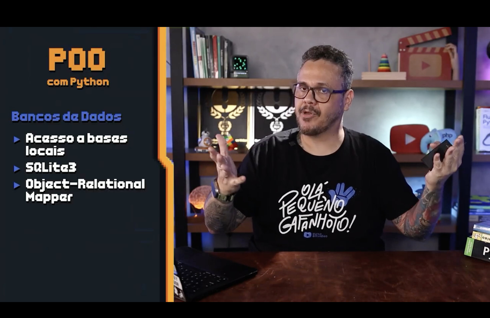

<h1 align="center">
  Curso em Video - Python Mundo 4 <br> Python e POO — Programação Orientada a Objetos <br>
  🏛️🧬
</h1>

<p align="center">
  
</p>

<p align="center">
    
    
    
    
    
</p>

>Material de apoio do **Mundo 4** — a virada de chave de Python **procedural** (Mundos 1 a 3) para Python **orientado a objetos**: classes, objetos, atributos, métodos, os 4 pilares da POO e, mais adiante, persistência com **SQLite3**. 

<h2 align="left">🧭 Sumário: </h2>

1. [Onde estamos: do Mundo 3 ao Mundo 4](#1-onde-estamos)
2. [Esse mundo é para mim?](#2-para-mim)
3. [Embasamento: de onde veio a POO](#3-embasamento)
4. [Nomenclaturas: POO, OOP, OOAD](#4-nomenclaturas)
5. [Fundamentação: os conceitos da POO](#5-fundamentacao)
6. [Os 4 pilares da POO](#6-pilares)
7. [Depois da POO: Bancos de Dados](#7-bancos-de-dados)
8. [Estrutura de pastas do Mundo 4](#8-estrutura)
9. [Resumo final](#9-resumo)

<h2 align="left" id="1-onde-estamos">🗺️ 1. Onde estamos: do Mundo 3 ao Mundo 4</h2>

Os Mundos 1 a 3 constroem a **base procedural**: variáveis, condicionais, laços, tuplas, listas, dicionários, funções e módulos — tudo isso fechado com o [menu de terminal do exercício 115](../../Mundo3/ex115/md/MENU_TERMINAL.md). O Mundo 4 muda o **paradigma**: em vez de organizar o código em funções soltas que recebem e devolvem dados, passamos a modelar o problema em **classes** que agrupam dados (atributos) e comportamentos (métodos) em um único lugar.

<p align="center">
  
</p>

| Mundo | Foco | Paradigma |
|---|---|---|
| 1 e 2 | Sintaxe, lógica, estruturas de decisão e repetição | Procedural |
| 3 | Tuplas, listas, dicionários, funções, módulos, tratamento de erros | Procedural (com organização em módulos) |
| **4** | **Classes, objetos, atributos, métodos, os 4 pilares** | **Orientado a Objetos (POO)** |

<h2 align="left" id="2-para-mim">🎯 2. Esse mundo é para mim?</h2>

De acordo com o próprio curso, o Mundo 4 é recomendado para quem:

<p align="center">
  
</p>

| Requisito | Por quê importa |
|---|---|
| ✅ Quer aprender os **fundamentos da POO** | É o objetivo central deste mundo |
| ✅ Já sabe a **base da programação** | Condicionais, laços e funções são pré-requisito |
| ✅ Já conhece os **fundamentos de Python** | Sintaxe, tipos, coleções (Mundos 1-3) |
| ✅ Tem **disposição para treinar** | POO exige prática — o conceito só "clica" escrevendo classes |

<h2 align="left" id="3-embasamento">📚 3. Embasamento: de onde veio a POO</h2>

Antes de escrever `class`, vale entender **de onde o paradigma surgiu** e **por que ele existe** — isso evita decorar sintaxe sem saber o motivo.

<p align="center">
  
</p>

| Pergunta | Resposta resumida |
|---|---|
| 🕰️ De onde veio? | Da necessidade de organizar sistemas cada vez maiores, aproximando o código de como pensamos o mundo real (em "objetos") |
| 🧩 Para que serve? | Modelar entidades do domínio (Cliente, Produto, Conta) como unidades com dados + comportamento |
| ⚡ Vantagens de uso | Reuso (herança), organização, manutenção mais simples e código mais próximo do problema real |
| 🧠 Entendendo o paradigma | Trocar "funções que manipulam dados soltos" por "objetos que sabem se manipular" |

> 📖 Aprofundamento com a linha do tempo completa — da crise do software de 1960 a Simula, Smalltalk e Python — em [DE_ONDE_VEIO_POO.md](DE_ONDE_VEIO_POO.md).
>
> 🚗 Aprofundamento das vantagens — o acrônimo `COMERN` explicado peça por peça com a analogia de um carro — em [AS_6_VANTAGENS_POO.md](AS_6_VANTAGENS_POO.md).

<h2 align="left" id="4-nomenclaturas">🔤 4. Nomenclaturas: POO, OOP, OOAD</h2>

O mesmo conceito aparece com siglas diferentes dependendo da fonte — vale reconhecer todas, pois a literatura e a documentação em inglês usam a sigla `OOP`.

<p align="center">
  
</p>

| Sigla | Significado | Onde aparece |
|---|---|---|
| `POO` | Programação Orientada a Objetos | Material em português (este curso) |
| `OOP` | *Object-Oriented Programming* | Documentação e artigos em inglês |
| `OOAD` | *Object-Oriented Analysis and Design* | Etapa de **modelagem** (antes de programar): analisar o domínio e desenhar as classes |

<h2 align="left" id="5-fundamentacao">🔬 5. Fundamentação: os conceitos da POO</h2>

Esse é o vocabulário mínimo para ler e escrever qualquer classe em Python.

<p align="center">
  
</p>



| Conceito | O que é | Analogia |
|---|---|---|
| **Classe** | O molde/planta que define atributos e métodos | A planta de uma casa |
| **Objeto** | Uma instância concreta criada a partir da classe | Uma casa construída a partir da planta |
| **Atributos** | Variáveis que guardam o **estado** do objeto | Cor, tamanho, número de quartos da casa |
| **Métodos** | Funções definidas dentro da classe — o **comportamento** do objeto | Abrir a porta, ligar a luz |
| **Estado** | O conjunto de valores dos atributos em um dado momento | Como a casa está "agora" |
| **Instância** | Sinônimo de objeto — "instanciar" é criar um objeto a partir da classe | Construir uma casa a partir da planta |
| **Visibilidade** | Define se um atributo/método pode ser acessado de fora da classe (`_privado`, `__nome`) | Portas trancadas vs. portas abertas da casa |

> 🍪 Aprofundamento com a analogia do cortador de biscoitos — classe, objeto, instância e estado explicados passo a passo — em [CLASSES_OBJETOS_INSTANCIAS.md](CLASSES_OBJETOS_INSTANCIAS.md).

```python
class Cliente:
    def __init__(self, nome, idade):
        self.nome = nome        # atributo público
        self._idade = idade     # atributo "protegido" por convenção (_)

    def aniversario(self):      # método
        self._idade += 1

cliente1 = Cliente("Lucas", 25)  # objeto / instância de Cliente
cliente1.aniversario()           # muda o estado do objeto
```

<h2 align="left" id="6-pilares">🏛️ 6. Os 4 pilares da POO</h2>

A mesma imagem da fundamentação fecha com os **4 pilares** — os princípios que toda linguagem orientada a objetos (Python incluso) implementa de alguma forma.

| Pilar | Resumo |
|---|---|
| 🔐 **Encapsulamento** | Esconder os detalhes internos do objeto e expor só o necessário (atributos `_protegidos`/`__privados` + métodos públicos) |
| 🧬 **Herança** | Uma classe filha reaproveita atributos e métodos de uma classe pai (`class ClienteVIP(Cliente):`) |
| 🎭 **Polimorfismo** | Objetos de classes diferentes respondem ao mesmo método de formas diferentes |
| 🧩 **Abstração** | Modelar só o que importa para o problema, ignorando detalhes irrelevantes do mundo real |

<h2 align="left" id="7-bancos-de-dados">🗄️ 7. Depois da POO: Bancos de Dados</h2>

Depois de fechar POO, o Mundo 4 segue para **persistência de dados** — sair da memória (listas/dicionários que somem ao fechar o programa) e gravar em disco.

<p align="center">
  
</p>

| Tópico | O que é |
|---|---|
| 🗂️ Acesso a bases locais | Ler/escrever dados que sobrevivem ao fim da execução do programa |
| 🪶 SQLite3 | Banco de dados relacional leve, embutido na biblioteca padrão do Python (`import sqlite3`) |
| 🧭 Object-Relational Mapper (ORM) | Camada que mapeia **classes Python** para **tabelas do banco**, unindo POO e persistência |

<h2 align="left" id="8-estrutura">🗂️ 8. Estrutura de pastas do Mundo 4</h2>

Seguindo o mesmo padrão do [`Mundo3/ex115`](../../Mundo3/ex115/md/MENU_TERMINAL.md), cada exercício de POO terá seu próprio espaço, e os exercícios continuam a numeração global do curso (o Mundo 3 fechou em `115`).

<pre>
Mundo4🌍/
├── img/ 
│   ├── mundo4-01-perguntas.jpeg
│   ├── mundo4-02-onde-esta-o-mundo4.png
│   ├── mundo4-03-para-quem-e.png
│   ├── mundo4-04-embasamento.jpeg
│   ├── mundo4-05-nomenclaturas.jpeg
│   ├── mundo4-06-fundamentacao.jpeg
│   ├── mundo4-07-bancos-de-dados.png
│   └── poo-classes-01-titulo.png ... poo-classes-13-objetos-abstratos.png
│
├── md/
│   ├── PYTHON_E_POO.md 
│   ├── DE_ONDE_VEIO_POO.md 
│   ├── AS_6_VANTAGENS_POO.md 
│   └── CLASSES_OBJETOS_INSTANCIAS.md 
│
└── ex116🧬/ ... ex158🧬/ 
</pre>

<h2 align="left" id="9-resumo">📌 9. Resumo final</h2>

```
┌───────────────────────────────────────────────────────────┐
│  PYTHON E POO — MUNDO 4                                     │
├───────────────────────────────────────────────────────────┤
│  🔀 muda o paradigma: de procedural para orientado a objetos │
│  🧬 classe = molde · objeto = instância da classe             │
│  🏷️ atributos = estado · ⚙️ métodos = comportamento           │
│  🏛️ 4 pilares: encapsulamento, herança, polimorfismo, abstração│
│  🗄️ na sequência: persistência com SQLite3 e ORM              │
└───────────────────────────────────────────────────────────┘
```

> 🎓 **Conclusão:** a POO não substitui o que foi aprendido nos Mundos 1 a 3 — ela reorganiza esse conhecimento em torno de **objetos que carregam seu próprio estado e comportamento**, preparando o terreno para os exercícios `116` em diante e, depois, para persistir tudo isso em um banco de dados real.
