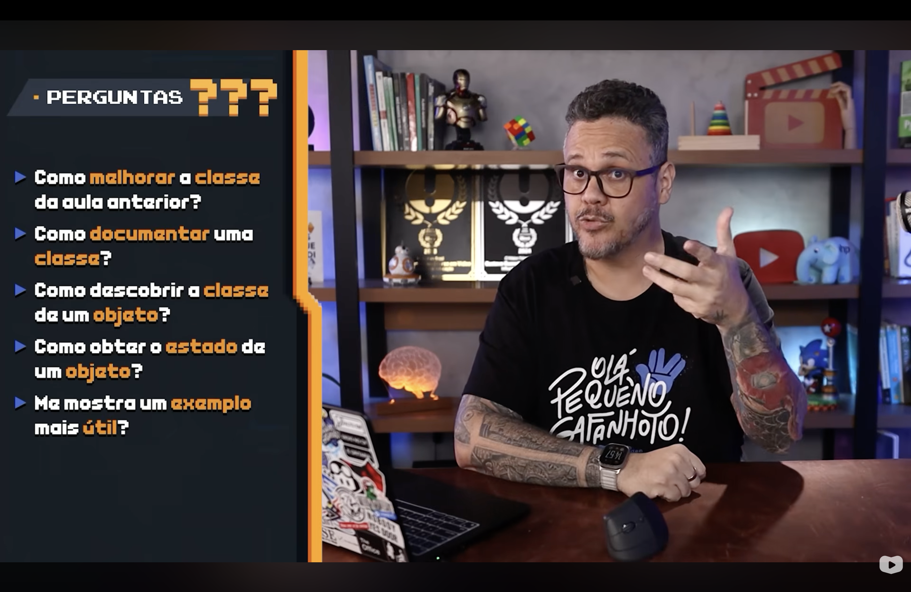
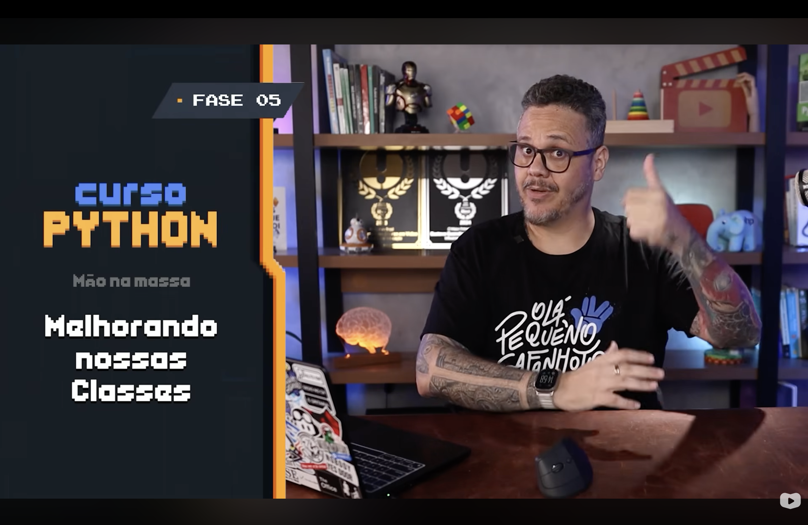
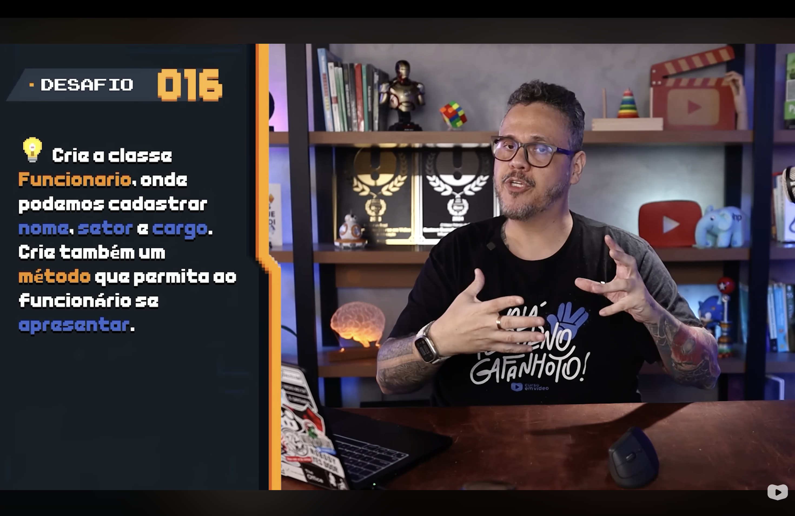
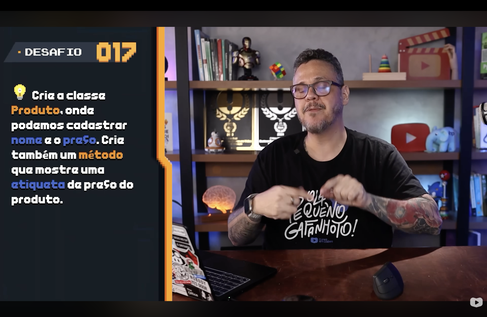
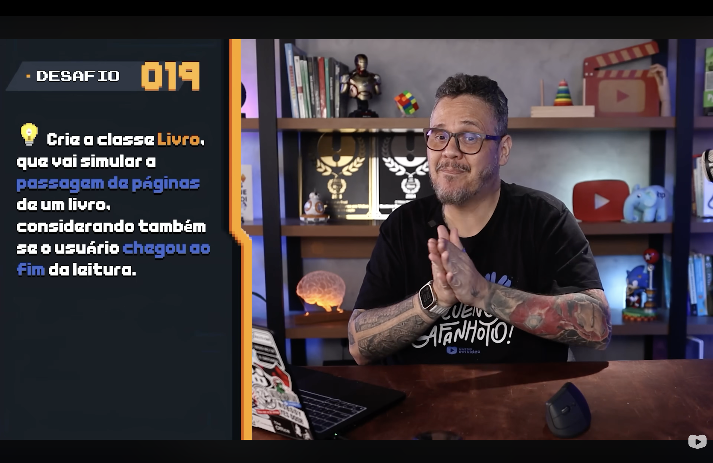
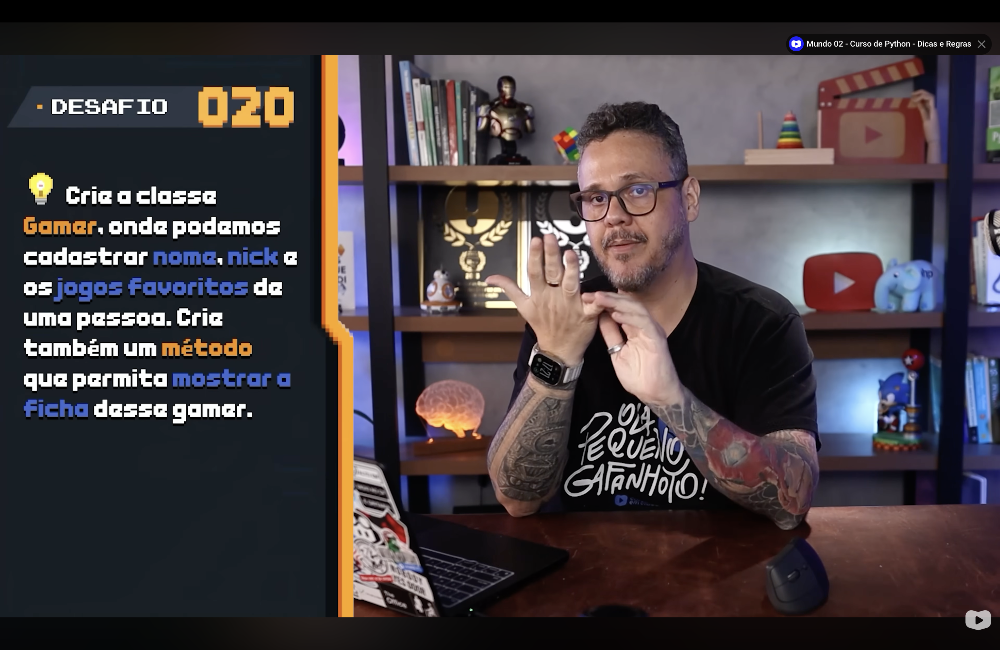
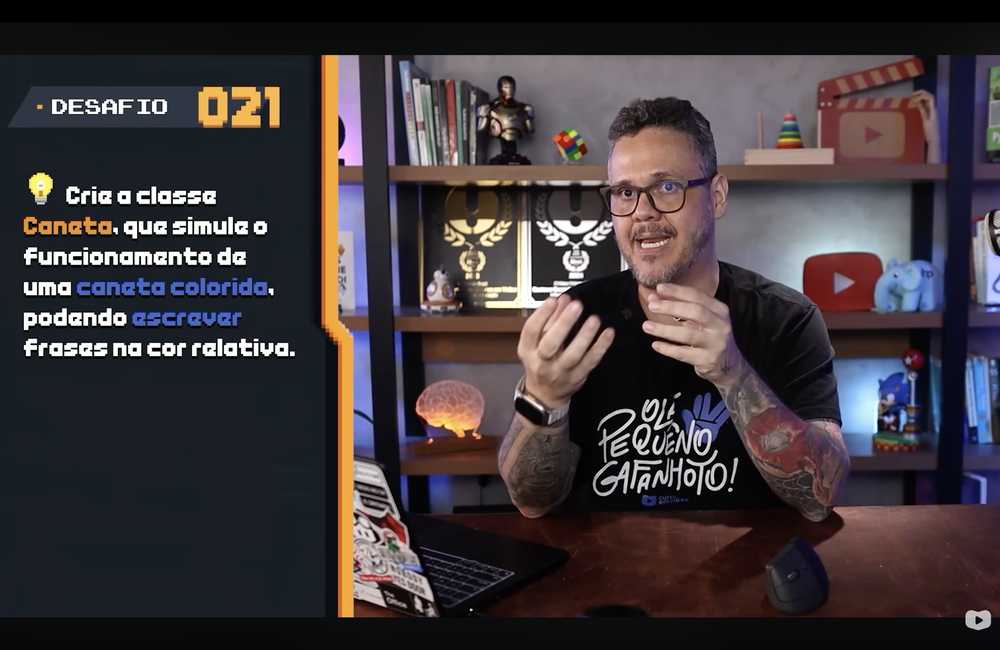
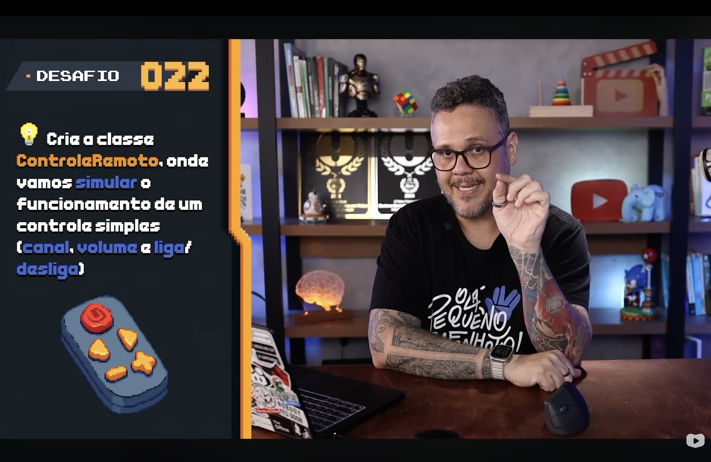

<h1 align="center">
  Curso em Video - Python Mundo 4 <br> Respostas 16-22 — <br>
  Desafios de Classes com Rich <br>
  🏆🐍
</h1>

<p align="center">
  
</p>

<p align="center">
    
    
    
    
    
</p>

>Os desafios **1 a 15** deste módulo são teóricos e já foram respondidos em [DE_ONDE_VEIO_POO.md](DE_ONDE_VEIO_POO.md), [AS_6_VANTAGENS_POO.md](AS_6_VANTAGENS_POO.md), [PYTHON_E_POO.md](PYTHON_E_POO.md), [CLASSES_OBJETOS_INSTANCIAS.md](CLASSES_OBJETOS_INSTANCIAS.md) e [OBJETOS_VARIAVEIS_EVOLUIDAS.md](OBJETOS_VARIAVEIS_EVOLUIDAS.md). Este documento cobre os desafios **práticos 16 a 22**, propostos na aula [Melhorando nossas Classes](MELHORANDO_CLASSES.md), resolvidos nos arquivos [`119.py`](../119.py) a [`125.py`](../125.py) — cada um usando a biblioteca [Rich](BIBLIOTECA_RICH.md) para exibir o próprio enunciado com as mesmas cores do slide da aula (laranja para a classe/método, azul para os campos). 

<p align="center">
  
</p>

<p align="center">
  
</p>

<h2 align="left">🧭 Sumário: </h2>

1. [Desafio 016 — Funcionario](#desafio-016)
2. [Desafio 017 — Produto](#desafio-017)
3. [Desafio 018 — Churrasco](#desafio-018)
4. [Desafio 019 — Livro](#desafio-019)
5. [Desafio 020 — Gamer](#desafio-020)
6. [Desafio 021 — Caneta](#desafio-021)
7. [Desafio 022 — ControleRemoto](#desafio-022)
8. [Resumo final](#resumo)

<h2 align="left" id="desafio-016">🧑‍💼 Desafio 016 — Funcionario</h2>

<p align="center">
  
</p>

> Crie a classe `Funcionario`, onde podemos cadastrar `nome`, `setor` e `cargo`. Crie também um `método` que permita ao funcionário se `apresentar`.

Resolvido em [`119.py`](../119.py):

```python
class Funcionario:
    def __init__(self, nome: str, setor: str, cargo: str) -> None:
        self.nome = nome
        self.setor = setor
        self.cargo = cargo

    def apresentar(self) -> str:
        return f"Olá, meu nome é {self.nome}, trabalho no setor de {self.setor} como {self.cargo}."
```

`apresentar()` **devolve** a frase em vez de imprimi-la — a mesma separação entre lógica e exibição discutida na [seção 5 de MELHORANDO_CLASSES.md](MELHORANDO_CLASSES.md#5-srp): quem chama decide se mostra o resultado num `Panel` da Rich, num teste ou em outro lugar qualquer.

<h2 align="left" id="desafio-017">🏷️ Desafio 017 — Produto</h2>

<p align="center">
  
</p>

> Crie a classe `Produto`, onde podemos cadastrar `nome` e o `preço`. Crie também um `método` que mostre uma `etiqueta de preço` do produto.

Resolvido em [`120.py`](../120.py):

```python
class Produto:
    def __init__(self, nome: str, preco: float) -> None:
        self.nome = nome
        self.preco = preco

    def etiqueta(self) -> str:
        return f"{self.nome} — R$ {self.preco:.2f}"
```

<h2 align="left" id="desafio-018">🍖 Desafio 018 — Churrasco</h2>

<p align="center">
  
</p>

> Crie a classe `Churrasco`, onde seja possível informar `quantas pessoas` vão participar e mostre `quanto de carne` deve ser comprado, o `custo total` do churrasco e o `preço por pessoa`.

Resolvido em [`121.py`](../121.py). A quantidade de carne, o custo e o preço por pessoa são `@property` — valores **derivados** de `pessoas` e `preco_kg`, calculados sob demanda em vez de guardados (e possivelmente desatualizados) em atributos separados:

```python
class Churrasco:
    CONSUMO_POR_PESSOA_KG = 0.5  # meio quilo de carne por pessoa

    def __init__(self, pessoas: int, preco_kg: float) -> None:
        self.pessoas = pessoas
        self.preco_kg = preco_kg

    @property
    def carne_necessaria_kg(self) -> float:
        return self.pessoas * self.CONSUMO_POR_PESSOA_KG

    @property
    def custo_total(self) -> float:
        return self.carne_necessaria_kg * self.preco_kg

    @property
    def preco_por_pessoa(self) -> float:
        return self.custo_total / self.pessoas
```

<h2 align="left" id="desafio-019">📖 Desafio 019 — Livro</h2>

<p align="center">
  
</p>

> Crie a classe `Livro`, que vai simular a `passagem de páginas` de um livro, considerando também se o usuário `chegou ao fim` da leitura.

Resolvido em [`122.py`](../122.py). A simulação da leitura usa `track()`, o mesmo recurso de barra de progresso apresentado na [seção 8 de BIBLIOTECA_RICH.md](BIBLIOTECA_RICH.md#8-progress):

```python
class Livro:
    def __init__(self, titulo: str, total_paginas: int) -> None:
        self.titulo = titulo
        self.total_paginas = total_paginas
        self.pagina_atual = 0

    def passar_pagina(self, quantidade: int = 1) -> None:
        self.pagina_atual = min(self.pagina_atual + quantidade, self.total_paginas)

    @property
    def chegou_ao_fim(self) -> bool:
        return self.pagina_atual >= self.total_paginas
```

`passar_pagina()` trava em `total_paginas` com `min()` — não existe jeito de "passar" além da última página.

<h2 align="left" id="desafio-020">🎮 Desafio 020 — Gamer</h2>

<p align="center">
  
</p>

> Crie a classe `Gamer`, onde podemos cadastrar `nome`, `nick` e os `jogos favoritos` de uma pessoa. Crie também um `método` que permita mostrar a `ficha` desse gamer.

Resolvido em [`123.py`](../123.py). Diferente dos desafios anteriores, o enunciado pede explicitamente um método que **mostre** a ficha — por isso, aqui, `mostrar_ficha()` monta e imprime uma `Table` da Rich diretamente:

```python
class Gamer:
    def __init__(self, nome: str, nick: str, jogos_favoritos: list[str]) -> None:
        self.nome = nome
        self.nick = nick
        self.jogos_favoritos = jogos_favoritos

    def mostrar_ficha(self) -> None:
        tabela = Table(title=f"Ficha de {self.nick}")
        tabela.add_column("Campo")
        tabela.add_column("Valor")
        tabela.add_row("Nome", self.nome)
        tabela.add_row("Nick", self.nick)
        tabela.add_row("Jogos favoritos", ", ".join(self.jogos_favoritos))
        console.print(tabela)
```

<h2 align="left" id="desafio-021">🖊️ Desafio 021 — Caneta</h2>

<p align="center">
  
</p>

> Crie a classe `Caneta`, que simule o funcionamento de uma `caneta colorida`, podendo `escrever` frases na cor relativa.

Resolvido em [`124.py`](../124.py). `CORES_VALIDAS` mapeia nome da cor → código hexadecimal usado no markup da Rich; escolher uma cor fora da lista levanta `ValueError` no `__init__`, como discutido na [seção 4 de MELHORANDO_CLASSES.md](MELHORANDO_CLASSES.md#4-validacao):

```python
class Caneta:
    CORES_VALIDAS = {"vermelho": "#FF4136", "azul": "#3B82F6", "verde": "#2ECC71", "preto": "#FFFFFF"}

    def __init__(self, cor: str) -> None:
        cor = cor.lower()
        if cor not in self.CORES_VALIDAS:
            raise ValueError(f"Cor inválida: {cor!r}. Escolha entre: {', '.join(self.CORES_VALIDAS)}")
        self.cor = cor

    def escrever(self, frase: str) -> None:
        console.print(f"[bold {self.CORES_VALIDAS[self.cor]}]{frase}[/]")
```

<h2 align="left" id="desafio-022">📺 Desafio 022 — ControleRemoto</h2>

<p align="center">
  
</p>

> Crie a classe `ControleRemoto`, onde vamos simular o funcionamento de um controle simples (`canal`, `volume` e `liga/desliga`).

Resolvido em [`125.py`](../125.py). `muda_canal()` e `muda_volume()` só têm efeito com o controle ligado, e usam `max`/`min` para travar os valores dentro da faixa válida (canal 1-99, volume 0-100):

```python
class ControleRemoto:
    CANAL_MIN, CANAL_MAX = 1, 99
    VOLUME_MIN, VOLUME_MAX = 0, 100

    def __init__(self) -> None:
        self.ligado = False
        self.canal = self.CANAL_MIN
        self.volume = self.VOLUME_MIN

    def liga_desliga(self) -> None:
        self.ligado = not self.ligado

    def muda_canal(self, direcao: int) -> None:
        if not self.ligado:
            return
        self.canal = max(self.CANAL_MIN, min(self.CANAL_MAX, self.canal + direcao))

    def muda_volume(self, direcao: int) -> None:
        if not self.ligado:
            return
        self.volume = max(self.VOLUME_MIN, min(self.VOLUME_MAX, self.volume + direcao))
```

<h2 align="left" id="resumo">📌 Resumo final</h2>

| Desafio | Classe | Arquivo | Conceito em destaque |
|---|---|---|---|
| 016 | `Funcionario` | [`119.py`](../119.py) | Método que devolve texto (não imprime) |
| 017 | `Produto` | [`120.py`](../120.py) | Formatação de valor monetário |
| 018 | `Churrasco` | [`121.py`](../121.py) | `@property` para valores derivados |
| 019 | `Livro` | [`122.py`](../122.py) | Estado interno + `track()` da Rich |
| 020 | `Gamer` | [`123.py`](../123.py) | Método que monta e exibe uma `Table` |
| 021 | `Caneta` | [`124.py`](../124.py) | Validação de cor com `raise ValueError` |
| 022 | `ControleRemoto` | [`125.py`](../125.py) | Estado + limites com `max`/`min` |

> 🎓 **Conclusão:** todos os sete desafios seguem o mesmo padrão visual do slide da aula — um `Panel` da Rich reproduz o próprio enunciado, com `[bold #FFA500]` para a classe/método e `[bold #3B82F6]` para os campos citados — antes de rodar a implementação. O objetivo não foi só resolver cada desafio, mas aplicar o que [MELHORANDO_CLASSES.md](MELHORANDO_CLASSES.md) e [BIBLIOTECA_RICH.md](BIBLIOTECA_RICH.md) ensinaram: métodos que devolvem valor em vez de só imprimir, validação cedo com `raise`, `@property` para dados derivados, e a Rich para separar apresentação de lógica de negócio .
