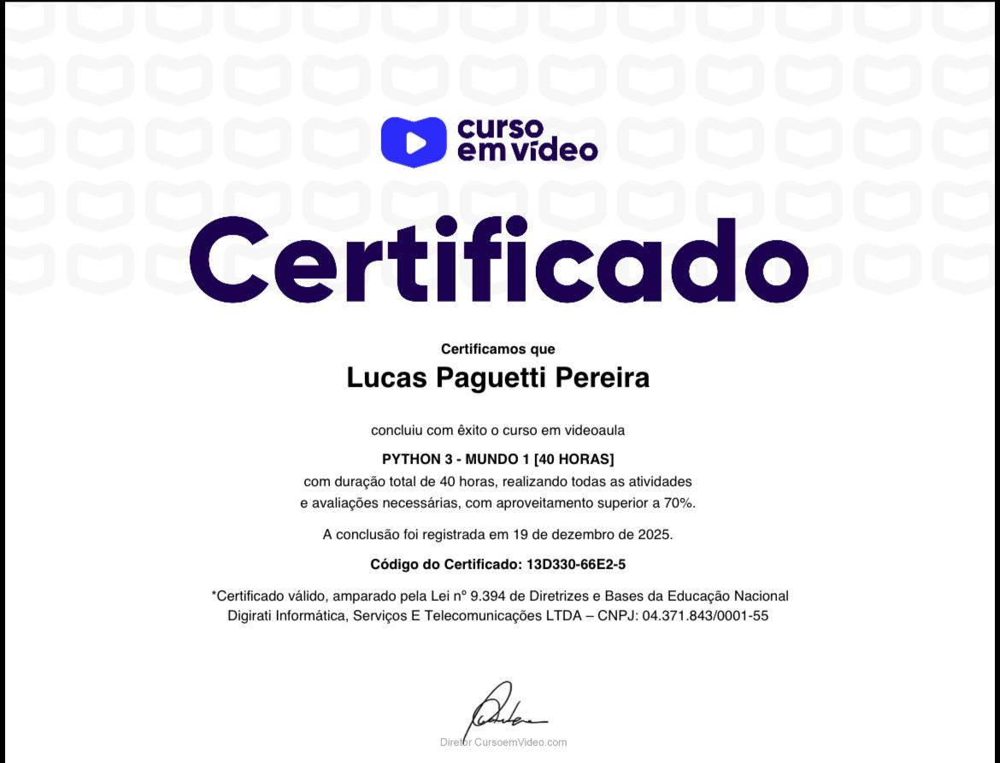
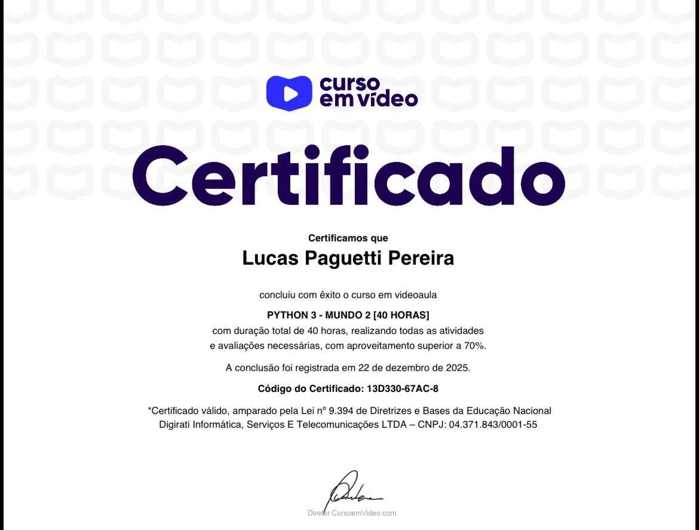

<h1 align="center">
  Mundos Python – Curso em Vídeo
   🌍🖖
</h1>

  

  Repositório de estudos baseado nos Mundos de Python do 
  <strong>Curso em Vídeo</strong>, ministrado pelo Prof. <strong>Gustavo Guanabara 👨🏻‍🏫 <strong>

<h2 align="center">👨🏻‍💻 Autor deste Repositório: </h2>

Lucas Paguetti Pereira 🧙‍♂️  
🏫 Instuição: Cesar School 🎓🧡  
📍 Recife, Pernambuco — <strong>Brazil</strong> 🇧🇷  

 

<h2 align="center">🌐 Curso em Vídeo</h2>

<h2 align="center">📘 Conteúdo dos Mundos</h2>

<h3>🌍 Mundo 1 – Fundamentos 📘</h3>

- Primeiros passos com Python  
- Variáveis e tipos primitivos (`int`, `float`, `bool`, `str`)  
- Entrada e saída de dados (`input`, `output`)  
- Operadores aritméticos  
- Execução de scripts no terminal  

---

<h3>🌎 Mundo 2 – Estruturas de Controle 🕹️</h3>

- Condicionais (`if`, `elif`, `else`)  
- Laços de repetição (`for`, `while`)  
- Validações `✅`
- Lógica de programação **aplicada**

---

<h3>🌏 Mundo 3 – Estruturas Compostas 📚</h3>

- Tuplas: ()
- Listas: []
- Dicionários: {} 
- Funções (`def function ()`)  
- Módulos e pacotes  
- Tratamento de erros `❌`  
- Organização de projetos  

---

<h3>🌍 Mundo 4 – Python e POO
  
  
</h3>

- Em andamento (2026 👀)

---

<h2 align="center">🗂️ Estrutura do Projeto: </h2>

<pre>
Mundos Python Guanabara/
├── mundo1🌍/
│   └── exércicios(1-35)
│
├── mundo2🌍/
│   └── exércicios(36-71)
│
├── mundo3🌍/
│   └── exércicios(72-114)
│
├── mundo4🌍/
│   └── exércicios
│
├── img/
│   └── cursoemvideo.jpeg
│   └── Mundo1_certificado.jpeg
│   └── Mundo2_certificado.jpeg
│
└── README.md
└── LICENSE

</pre>

 

<h2 align="center">Certificados do Curso em Vídeo dos Mundos de Python   🏆 🖖
</h2>

  

 

  

 
 

  
  
  

